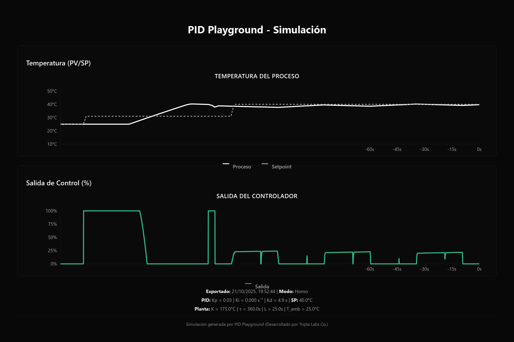
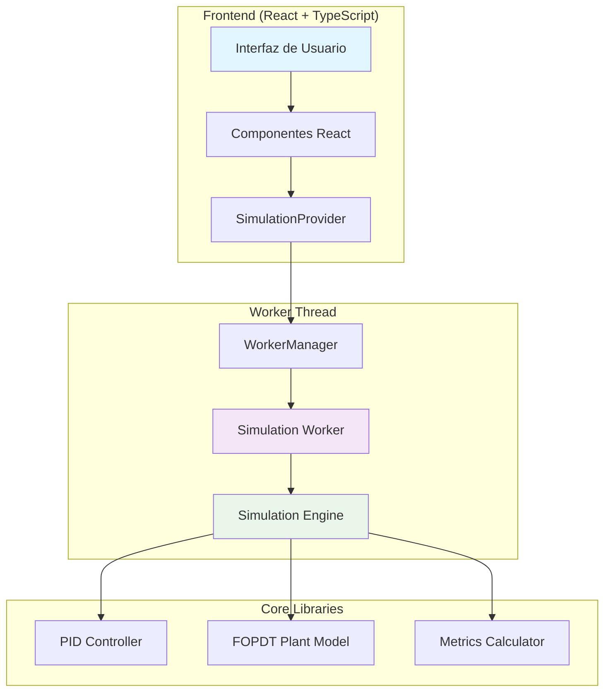
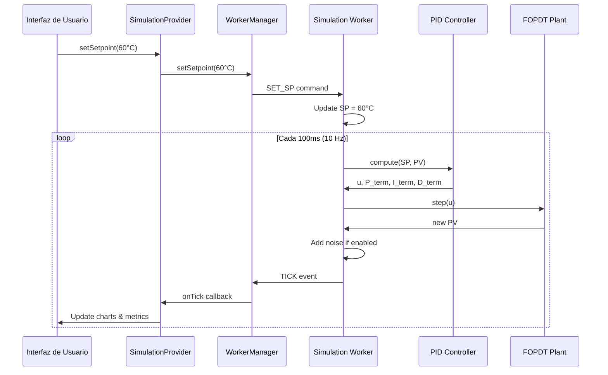

#  PID Playground


[](https://reactjs.org/)
[](https://www.typescriptlang.org/)
[](https://vitejs.dev/)
[](https://tailwindcss.com/)
[](https://ui.shadcn.com/)
[](https://recharts.org/)
[](https://opensource.org/licenses/MIT)
[](https://vitest.dev/)
[](https://vitest.dev/guide/coverage.html)

> **PID Playground - Simulador PID Industrial en Tiempo Real** - Una aplicación web avanzada para simular y analizar sistemas de control térmico usando controladores PID con modelo FOPDT.

## 🎯 Características Principales

###  Control PID Configurable
- **Ajuste de ganancias en tiempo real**:
  - `Kp` (0-100): Ganancia proporcional
  - `Ki` (0-10 s⁻¹): Ganancia integral
  - `Kd` (0-100 s): Tiempo derivativo
  - `N` (1-50): Factor de filtrado de derivada
  - `Tt` (0.1-100 s): Tiempo de tracking anti-windup
- **Presets predefinidos**: Conservador, Balanceado, Agresivo
- **Anti-windup** con back-calculation automático
- **Derivada filtrada** sobre PV para evitar kick derivativo

###  Modelo de Planta FOPDT
- **Parámetros ajustables**:
  - `K` (-100 a 200 °C): Ganancia efectiva del sistema
  - `τ` (tau: 1-600 s): Constante de tiempo
  - `L` (0-60 s): Tiempo muerto
  - `T_amb` (0-50 °C): Temperatura ambiente
- **Modos de operación**: Horno (calentamiento) o Chiller (enfriamiento)
- **Presets de planta**: Horno Industrial, Horno Compacto, Chiller Industrial
- **Discretización exacta** para estabilidad numérica garantizada

###  Simulación Realista
- **Ruido configurable**:
  - Habilitación on/off
  - Sigma ajustable (0-10 °C)
  - Generador pseudoaleatorio con seed configurable
- **Control SSR por ventana temporal**:
  - Periodo de ventana ajustable (1-60 s)
  - Simulación de control On/Off real
  - Visualización del ciclo de trabajo
- **Simulación en tiempo real** a 10 Hz (100ms por ciclo)

###  Visualización y Análisis
- **Gráficas en tiempo real**:
  - PV vs SP: Seguimiento del proceso
  - Salida PID: Señal de control (0-100%)
  - Componentes P, I, D visibles
- **Métricas automáticas**:
  - Overshoot (%) y tiempo al pico
  - Settling time (criterio ±5%)
  - Error estacionario
- **Ventanas de tiempo**: 30s, 60s, 300s
- **Exportación de datos**:
  - Formato CSV con timestamp
  - Incluye todos los estados (t, SP, PV, u, P, I, D)
  - Metadatos de configuración
  - Ventana configurable o datos completos


## 🚀 Demo en Vivo

**[Ver Demo Online](https://pid-playground.triptalabs.com.co)**

## 📸 Ejemplo de Datos Exportados

### Formato CSV con Metadatos Completos



> Los datos exportados incluyen:
> - **Timestamp** de cada muestra
> - **Variables del proceso**: t, SP, PV, u
> - **Componentes PID**: P_term, I_term, D_term
> - **Estado de la planta**: plant_state
> - **Metadatos**: Configuración de PID y planta al momento de exportar
>
> *La imagen muestra un ejemplo de simulación con control SSR activado, donde se observa el comportamiento On/Off del controlador y las gráficas de temperatura (PV/SP) y salida de control.*

## 📦 Instalación

### Prerequisitos
- **Node.js** 18+ 
- **pnpm** (recomendado) o npm

### Instalación Rápida

```bash
# Clonar el repositorio
git clone https://github.com/triptamina-labs/PID-Playground.git
cd PID-Playground

# Instalar dependencias
pnpm install

# Iniciar servidor de desarrollo
pnpm dev
```

La aplicación estará disponible en `http://localhost:8080`

### Scripts Disponibles

```bash
pnpm dev          # Servidor de desarrollo
pnpm build        # Build de producción
pnpm preview      # Previsualizar build
pnpm test         # Ejecutar tests
pnpm test:coverage # Tests con cobertura
pnpm lint         # Linter y formateo
```

## 🏗️ Arquitectura del Sistema

### Diagrama de Arquitectura



### Flujo de Datos



##  Uso Rápido

### 1. Iniciar Simulación
1. **Seleccionar preset de planta**: Horno Industrial / Horno Compacto / Chiller Industrial
2. **Seleccionar preset PID**: Conservador / Balanceado / Agresivo
3. **Establecer setpoint**: Temperatura deseada (°C)
4. **Presionar Start**: Inicia la simulación en tiempo real

### 2. Ajustar Parámetros en Tiempo Real

**Parámetros PID:**
- Ajusta `Kp`, `Ki`, `Kd` con los sliders
- Modifica `N` (filtro derivada) y `Tt` (anti-windup)
- Observa el efecto inmediato en las gráficas

**Parámetros de Planta:**
- Cambia `K` (ganancia), `τ` (tau), `L` (tiempo muerto)
- Ajusta `T_amb` (temperatura ambiente)
- Alterna entre modo Horno/Chiller

### 3. Funcionalidades Avanzadas

**Simulación de Ruido:**
- Activa/desactiva el ruido en la medición
- Ajusta `σ` (sigma) para variar la intensidad
- Simula condiciones realistas de sensor

**Control SSR:**
- Habilita el control por ciclo de ventana
- Ajusta el periodo de ventana (1-60s)
- Observa el comportamiento On/Off real

**Exportar Datos:**
- Exporta datos de ventana temporal (30s, 60s, 300s)
- Exporta todos los datos históricos
- Formato CSV con metadatos completos

### 4. Métricas en Tiempo Real
- **Overshoot (%)**: Sobreimpulso máximo respecto al setpoint
- **Settling Time (s)**: Tiempo para establecerse en ±5% del SP
- **Peak Time (s)**: Tiempo al máximo sobreimpulso
- **Current Error**: Error instantáneo (SP - PV)

## 📚 Documentación Completa

> **[📖 Índice General de Documentación](./docs/README.md)** - Punto de entrada a toda la documentación

###  Para Usuarios
- **[Guía de Inicio](./docs/user-guide/getting-started.md)** - Primeros pasos en 5 minutos
- **[Tutorial Básico](./docs/user-guide/tutorials/01-basic-pid.md)** - Conceptos PID fundamentales
- **[Tutorial de Sintonización](./docs/user-guide/tutorials/02-tuning.md)** - Optimización de parámetros
- **[FAQ](./docs/user-guide/faq.md)** - Preguntas frecuentes

###  Para Desarrolladores
- **[Arquitectura](./docs/technical/architecture.md)** - Diseño del sistema
- **[API Reference](./docs/technical/api-reference.md)** - Interfaces y APIs
- **[Guía de Desarrollo](./docs/technical/development.md)** - Configuración y desarrollo

###  Para Especialistas
- **[Teoría PID](./docs/mathematical/theory/pid.md)** - Fundamentos matemáticos del controlador
- **[Modelo FOPDT](./docs/mathematical/theory/fopdt.md)** - Teoría de la planta térmica
- **[Estabilidad](./docs/mathematical/theory/stability.md)** - Análisis de estabilidad del sistema
- **[Referencias](./docs/mathematical/references.md)** - Bibliografía y recursos académicos

## 🛠️ Stack Tecnológico

| Área | Tecnología | Versión | Propósito |
|------|------------|---------|-----------|
| **Frontend** | React + TypeScript | 18.3.1 | UI principal |
| **Build** | Vite | 5.4.19 | Bundler y dev server |
| **UI Components** | shadcn/ui + Radix UI | Latest | Componentes accesibles |
| **Styling** | Tailwind CSS | 3.4.17 | Estilos y tema |
| **Charts** | Recharts | 2.15.4 | Visualización de datos |
| **State Management** | React Context + Hooks | Built-in | Estado global |
| **Workers** | Web Workers | Native | Simulación paralela |
| **Testing** | Vitest | 3.2.4 | Unit testing |
| **Linting** | ESLint + TypeScript | Latest | Calidad de código |


## 🎯 Casos de Uso

###  Industria
- **Sintonización de hornos industriales**
- **Análisis de sistemas de control térmico**
- **Validación de parámetros PID antes de implementación**
- **Entrenamiento de operadores**

###  Educación
- **Enseñanza de control automático**
- **Experimentación con diferentes configuraciones**
- **Visualización de conceptos PID**
- **Análisis de respuesta del sistema**

###  Investigación
- **Validación de algoritmos de control**
- **Análisis de estabilidad**
- **Optimización de parámetros**
- **Comparación de estrategias de control**


## 🤝 Contribuir

###  Reportar Problemas
1. Buscar en [issues existentes](https://github.com/triptamina-labs/PID-Playground/issues)
2. Crear nuevo issue con template apropiado
3. Incluir pasos para reproducir y logs

###  Sugerir Mejoras
1. Crear issue con etiqueta `enhancement`
2. Describir caso de uso y beneficio
3. Proponer implementación si es posible

###  Contribuir Código
1. Fork del repositorio
2. Crear branch para feature/fix
3. Implementar cambios con tests
4. Ejecutar `pnpm test` y `pnpm lint`
5. Crear Pull Request con descripción detallada

###  Guías de Contribución
- **[Guía de Desarrollo](./docs/technical/development.md)** - Configuración, convenciones y procesos
- **[CONTRIBUTING.md](./CONTRIBUTING.md)** - Normas generales de contribución

## 📄 Licencia

Este proyecto está licenciado bajo la **MIT License** - ver el archivo [LICENSE](LICENSE) para detalles.

---

<div align="center">

**¿Te gusta este proyecto? ¡Dale una ⭐ en GitHub!**

[](https://github.com/triptamina-labs/PID-Playground)
[](https://github.com/triptamina-labs/PID-Playground)
[](https://github.com/triptamina-labs/PID-Playground/issues)
[](https://github.com/triptamina-labs/PID-Playground/pulls)

*Desarrollado con ❤️*

</div>
