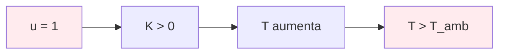
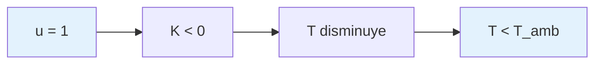

# Teoría del Modelo FOPDT

## Descripción General

El modelo FOPDT (First Order Plus Dead Time) es la representación matemática de la planta térmica en el PID Playground. Este modelo captura la dinámica de un horno o chiller con precisión suficiente para control educativo y validación de algoritmos PID.

## Ecuación Diferencial Continua

### Formulación Básica

La ecuación diferencial que describe el comportamiento térmico es:

```
τ·(dT/dt) + T = K·u(t-L) + T_amb
```

Donde:
- *T*(*t*) = Temperatura del sistema [°C]
- *τ* = Constante de tiempo [s]
- *K* = Ganancia estática [°C por unidad u]
- *u*(*t*) = Entrada de control [0-1]
- *L* = Tiempo muerto [s]
- *T_amb* = Temperatura ambiente [°C]

### Formulación Normalizada

Para facilitar el análisis, se define el estado normalizado:

```
x(t) = T(t) - T_amb
```

La ecuación se convierte en:

```
τ·(dx/dt) + x = K·u(t-L)
```

## Diagrama de Bloques

```mermaid
graph LR
    A[u(t)] --> B[Delay L]
    B --> C[Gain K]
    C --> D[1st Order τ]
    D --> E[x(t)]
    E --> F[+ T_amb]
    F --> G[T(t)]
    
    style A fill:#e1f5fe
    style G fill:#f3e5f5
    style B fill:#fff3e0
    style D fill:#fff3e0
```

## Discretización Exacta

### Motivación

La discretización exacta garantiza:
- Estabilidad incondicional para cualquier *T_s* > 0
- Precisión matemática que coincide con la solución analítica
- Sin drift en simulaciones de larga duración

### Derivación Matemática

#### 1. Solución Analítica Continua

Para un escalón unitario *u*(*t*) = 1, *t* ≥ 0:

```
x(t) = K·(1 - e^(-t/τ))     para t ≥ L
x(t) = 0                    para t < L
```

#### 2. Discretización Exacta

La ecuación de diferencias exacta es:

```
x[k+1] = φ·x[k] + γ·u[k-L_s]
```

Donde:
- *φ* = *e^(-T_s/τ)* (factor de decaimiento)
- *γ* = *K·(1 - φ)* (factor de ganancia)
- *L_s* = *L/T_s* (tiempo muerto en muestras)

### Implementación en el Simulador

Los parámetros de discretización se calculan como:

```
φ = exp(-T_s/τ)
γ = K·(1 - φ)
L_s = round(L/T_s)
```

La ecuación de actualización es:

```
x[k+1] = φ·x[k] + γ·u_delayed
T[k+1] = x[k+1] + T_amb
```

## Respuesta al Escalón

### Análisis Temporal

```mermaid
graph TD
    A[Escalón u(t) = 1] --> B[Delay L]
    B --> C[Respuesta exponencial]
    C --> D[Estado estacionario K]
    
    E[Características] --> F[Tiempo muerto L]
    E --> G[Constante tiempo τ]
    E --> H[Ganancia K]
    
    style A fill:#e8f5e8
    style D fill:#e8f5e8
```

### Parámetros Característicos

1. **Tiempo Muerto (L)**: Retardo puro antes de que la respuesta comience
2. **Constante de Tiempo (τ)**: Tiempo para alcanzar 63.2% del valor final
3. **Ganancia (K)**: Cambio final en temperatura por unidad de entrada

### Fórmulas de Respuesta

#### Tiempo de Subida (10% a 90%)
```
t_r = 2.2·τ
```

#### Tiempo de Establecimiento (5%)
```
t_s = 3·τ
```

#### Tiempo de Establecimiento (2%)
```
t_s = 4·τ
```

## Modos de Operación

### Modo Horno (Calentamiento)



- *K* > 0: Entrada positiva aumenta temperatura
- Respuesta: *T*(*t*) → *T_amb* + *K* cuando *t* → ∞

### Modo Chiller (Enfriamiento)



- *K* < 0: Entrada positiva disminuye temperatura
- Respuesta: *T*(*t*) → *T_amb* + *K* cuando *t* → ∞

## Validación Analítica

### Caso de Prueba 1: Sin Tiempo Muerto

**Parámetros**: *τ* = 60s, *K* = 1.2°C, *L* = 0s, *T_amb* = 25°C

**Solución analítica**:
```
T(t) = 25 + 1.2·(1 - e^(-t/60))
```

**Resultado**: Para t = 5τ = 300s, error debe ser < 1e-10

### Caso de Prueba 2: Con Tiempo Muerto

**Parámetros**: *τ* = 30s, *K* = 0.3°C, *L* = 10s, *T_amb* = 20°C

**Solución analítica**:
```
T(t) = 20                              para t < 10s
T(t) = 20 + 0.3·(1 - e^(-(t-10)/30))   para t ≥ 10s
```

## Casos Límite

### τ → 0 (Sistema Muy Rápido)

```
φ → 0, γ → K·T_s
x[k+1] ≈ K·T_s·u[k-L_s]
```

Comportamiento: Respuesta instantánea (integrador puro)

### τ → ∞ (Sistema Muy Lento)

```
φ → 1, γ → 0
x[k+1] ≈ x[k]
```

Comportamiento: Sistema estático (sin dinámica)

### L → 0 (Sin Tiempo Muerto)

```
L_s = 0
u[k-L_s] = u[k]
```

Comportamiento: Sistema de primer orden puro

## Análisis de Estabilidad

### Criterio de Estabilidad

La discretización exacta es incondicionalmente estable:

```
|φ| = |e^(-T_s/τ)| < 1    para todo T_s > 0, τ > 0
```

### Comparación con Euler

| Método | Estabilidad | Precisión | Complejidad |
|--------|-------------|-----------|-------------|
| Euler | Condicional (T_s < 2τ) | O(T_s) | Simple |
| Exacta | Incondicional | Exacta | Media |

### Ventajas de Discretización Exacta

1. Estabilidad garantizada para cualquier *T_s* > 0
2. Precisión matemática vs solución analítica
3. Sin drift en simulaciones largas
4. Validación trivial contra casos conocidos

## Referencias

1. **Franklin, G.F., et al.** "Digital Control of Dynamic Systems" - Capítulo 3
2. **Åström, K.J.** "Computer-Controlled Systems" - Sección 2.3
3. **Seborg, D.E., et al.** "Process Dynamics and Control" - Capítulo 5

---

**Implementación**: `src/lib/simulation/plant-model.ts`  
**Validación**: `tests/fopdt.validation.test.ts`
