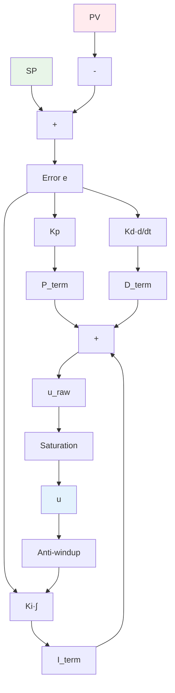
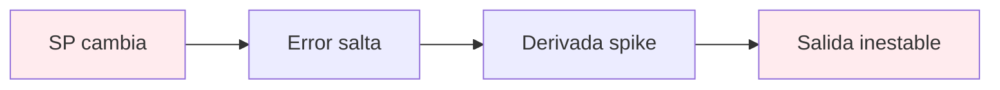
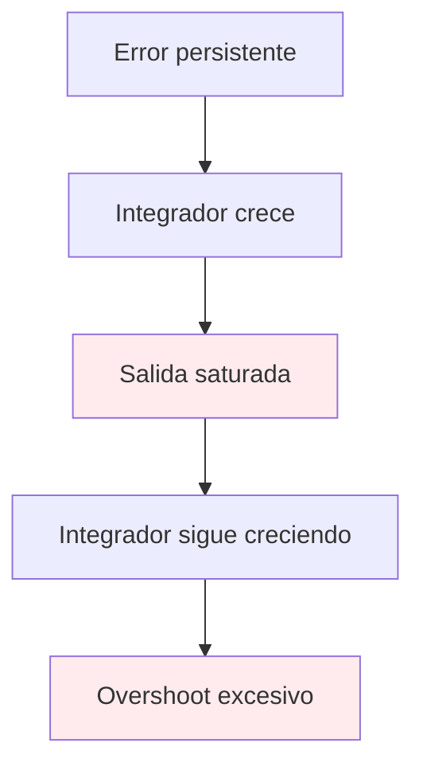
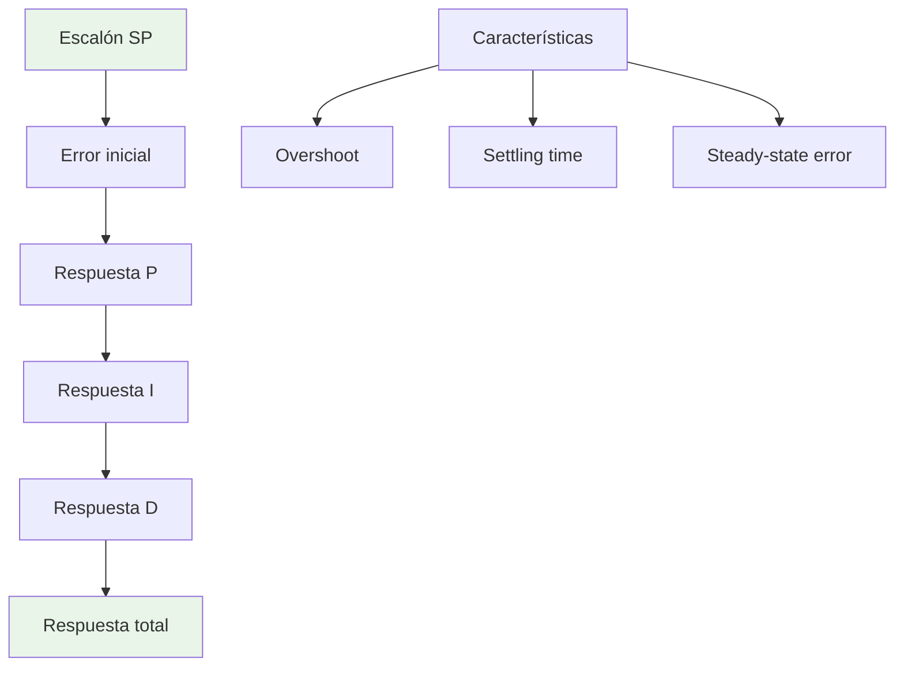
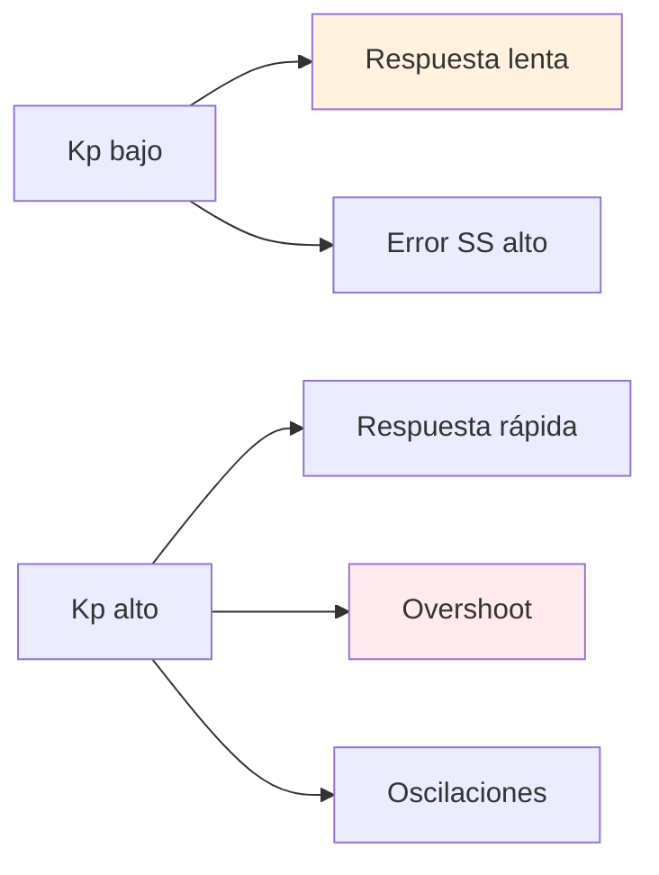
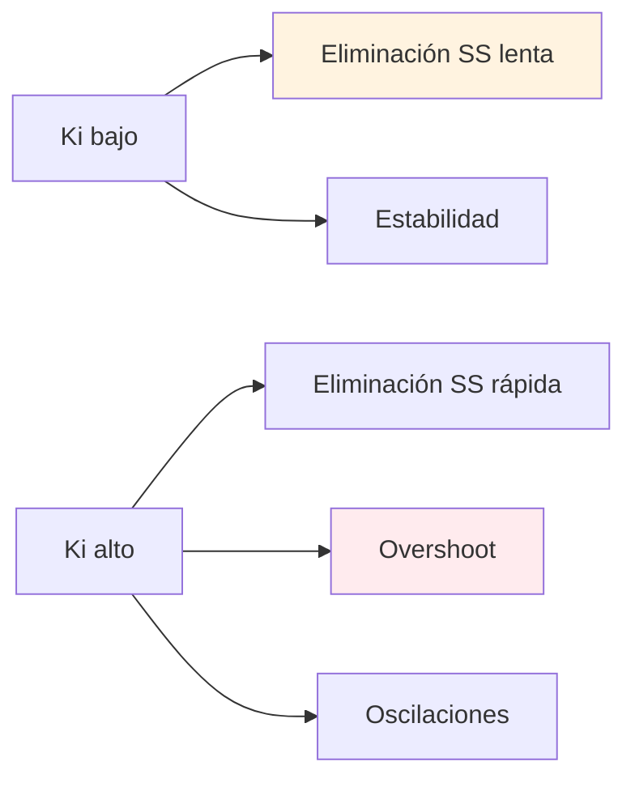
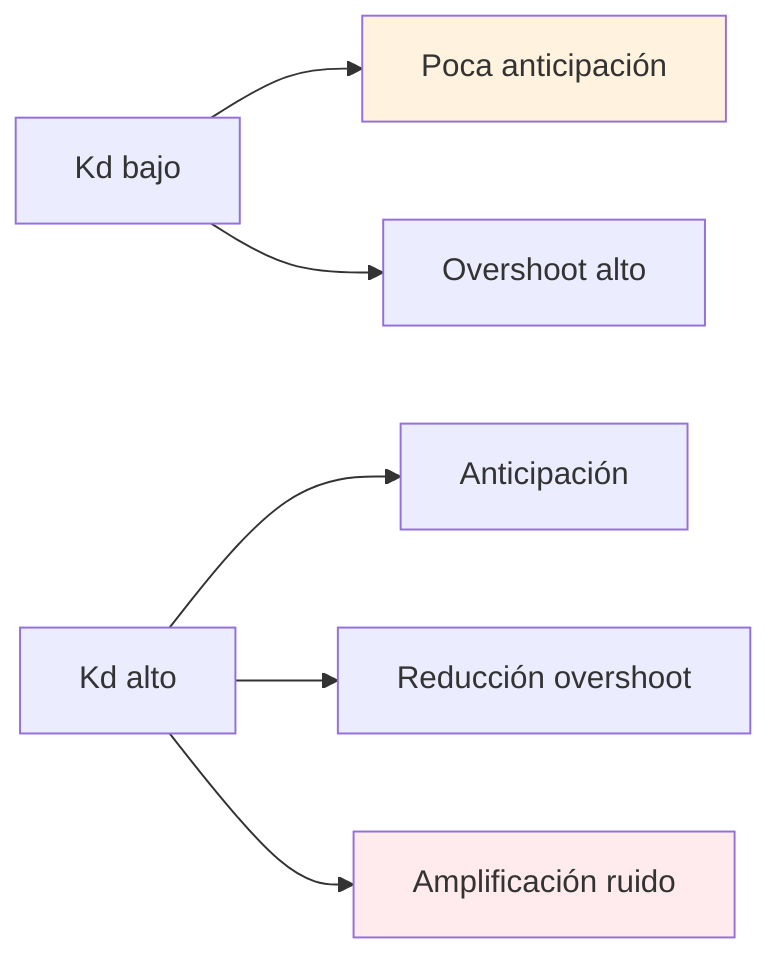
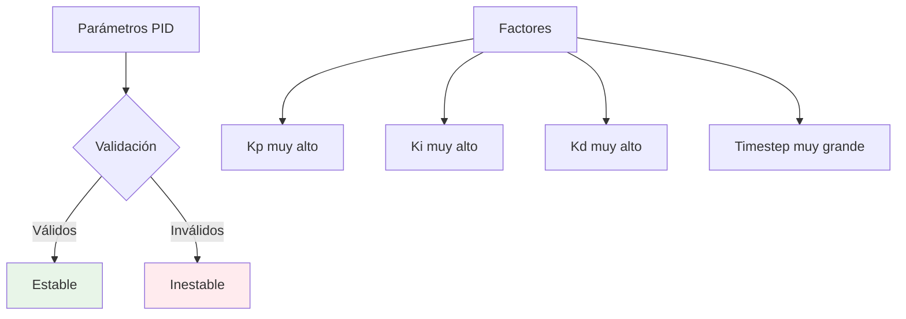

# Teoría del Controlador PID

## Descripción General

El controlador PID (Proportional-Integral-Derivative) implementado en el simulador incluye características avanzadas para uso industrial y educativo: derivada filtrada sobre la medida, anti-windup por back-calculation, y sintonía automática de parámetros.

## Formulación Matemática

### Ecuación Básica del PID

La salida del controlador PID está dada por:

```
u(t) = K_p·e(t) + K_i·∫e(τ)dτ + K_d·(de/dt)
```

Donde:
- *u*(*t*) = Salida de control [0-1]
- *e*(*t*) = Error = *SP*(*t*) - *PV*(*t*) [°C]
- *K_p* = Ganancia proporcional [adimensional]
- *K_i* = Ganancia integral [s⁻¹]
- *K_d* = Tiempo derivativo [s]

### Formulación Discreta

En forma discreta con timestep *T_s*:

```
u[k] = K_p·e[k] + K_i·T_s·Σe[i] + K_d·(e[k] - e[k-1])/T_s
```

## Diagrama de Bloques



## Implementación Avanzada

### 1. Derivada Filtrada sobre la Medida

#### Motivación

La derivada calculada sobre el error causa kick derivativo en cambios de setpoint:



#### Solución: Derivada sobre PV

```
D_term[k] = -K_d·(PV[k] - PV[k-1])/T_s
```

Ventajas:
- Elimina kick derivativo
- Reduce ruido de medición
- Comportamiento realista

#### Filtro de Primer Orden

Para reducir ruido adicional:

```
τ_f = K_d/N
α = τ_f/(τ_f + T_s)
D_filt[k] = α·D_filt[k-1] + (1-α)·(-K_d)·(PV[k] - PV[k-1])/T_s
```

Donde *N* = factor de filtro (default: 10)

### 2. Anti-windup por Back-calculation

#### Problema del Windup



#### Solución: Back-calculation

```
u_raw[k] = P_term[k] + I_term[k] + D_term[k]
u[k] = saturate(u_raw[k], 0, 1)
tracking_error = u[k] - u_raw[k]
I_term[k+1] = I_term[k] + K_i·T_s·e[k] + (T_s/T_t)·tracking_error
```

Donde *T_t* = tiempo de tracking [s]

## Análisis de Respuesta

### Respuesta al Escalón



### Efecto de Cada Término

#### Término Proporcional (K_p)



#### Término Integral (K_i)



#### Término Derivativo (K_d)



## Sintonía Automática

### Cálculo de Tiempo de Tracking

Heurística utilizada: Tt = Ti/4 donde Ti = Kp/Ki

Si Ki ≤ 0, entonces Tt = 1.0 (valor por defecto)

Valor mínimo: Tt = 0.1s

### Presets Típicos

| Preset | K_p | K_i [s⁻¹] | K_d [s] | N | Aplicación |
|--------|-----|-----------|---------|---|------------|
| Conservador | 1.0 | 0.1 | 0.0 | 10 | Procesos lentos |
| Balanceado | 2.0 | 0.2 | 5.0 | 10 | Uso general |
| Agresivo | 5.0 | 0.5 | 10.0 | 10 | Procesos rápidos |

### Reglas de Sintonía

#### Método de Ziegler-Nichols

1. **Determinar K_u**: Aumentar K_p hasta oscilaciones sostenidas
2. **Determinar T_u**: Período de oscilaciones
3. **Calcular parámetros**:
   - K_p = 0.6·K_u
   - K_i = 1.2·K_p/T_u
   - K_d = 0.075·K_p·T_u

#### Método de Cohen-Coon

Para sistemas FOPDT con L/τ < 1:

```
Kp = (1/K)·(τ/L)·(1 + L/(3τ))
Ki = (1/K)·(τ/L)·(1 + L/(3τ))·(1 + L/(6τ))
Kd = (1/K)·(τ/L)·(1 + L/(3τ))·L/6
```

## Casos Límite

### K_p → 0 (Control Puro I-D)

```
u(t) ≈ K_i·∫e(τ)dτ + K_d·(de/dt)
```

Comportamiento: Respuesta muy lenta, posible error de estado estacionario

### K_i → 0 (Control PD)

```
u(t) = K_p·e(t) + K_d·(de/dt)
```

Comportamiento: Respuesta rápida, error de estado estacionario permanente

### K_d → 0 (Control PI)

```
u(t) = K_p·e(t) + K_i·∫e(τ)dτ
```

Comportamiento: Sin anticipación, posible overshoot elevado

## Análisis de Estabilidad

### Criterios de Estabilidad

1. **Estabilidad de Lyapunov**: Para sistemas lineales
2. **Criterio de Routh-Hurwitz**: Para polinomios característicos
3. **Análisis de Nyquist**: Para sistemas con retardo

### Región de Estabilidad



### Condiciones de Estabilidad Numérica

- N·T_s ≤ 1 (para estabilidad del filtro derivativo)
- K_d/T_s < 1000 (para evitar amplificación excesiva de ruido)
- Todos los parámetros deben ser no negativos

## Referencias

1. **Åström, K.J. & Hägglund, T.** "Advanced PID Control" - Capítulos 3 y 6
2. **Visioli, A.** "Practical PID Control" - Derivada filtrada y anti-windup
3. **ISA Standard 51.1-1979** "Process Instrumentation Terminology"

---

**Implementación**: `src/lib/simulation/pid-controller.ts`  
**Validación**: `tests/pid.antiwindup.test.ts`, `tests/pid.derivative.noise.test.ts`
