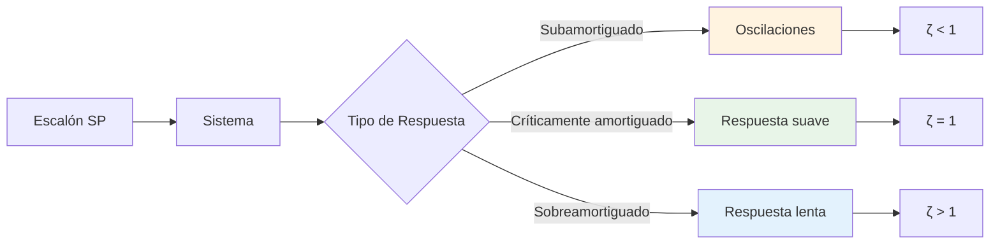
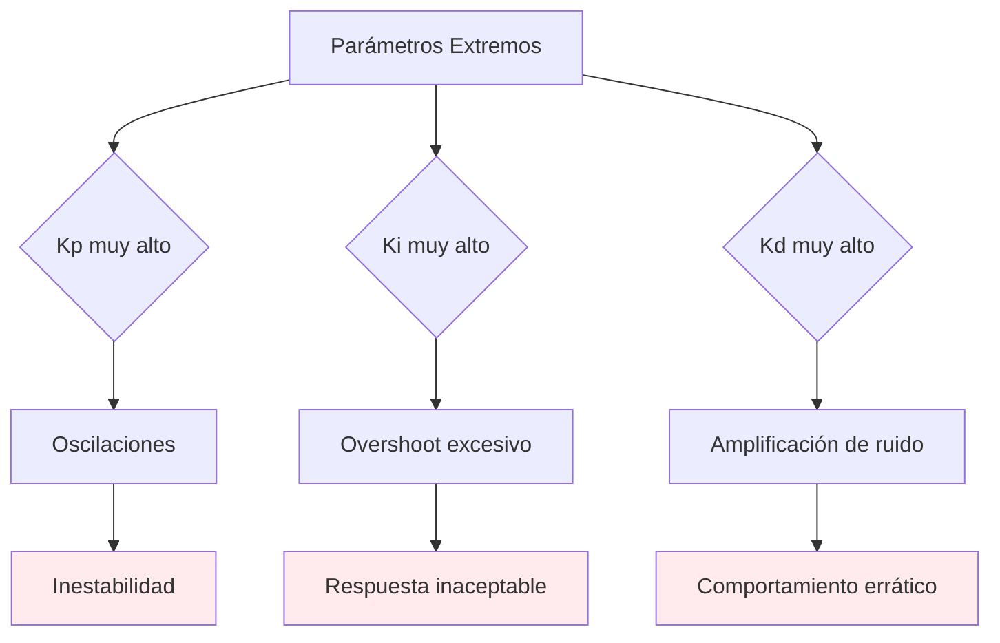

# Análisis de Estabilidad

## Descripción General

El análisis de estabilidad es fundamental para garantizar que el sistema de control PID funcione correctamente bajo todas las condiciones operativas. Este documento describe los criterios de estabilidad, métodos de análisis y validación numérica implementados en el PID Playground.

> **Estado Actual**: La validación básica de parámetros PID está implementada en el PID Playground. Los análisis avanzados de estabilidad (análisis de polos, márgenes de estabilidad, tests automatizados) son sugerencias para próximas versiones.

## Criterios de Estabilidad

### 1. Estabilidad de Lyapunov

#### Definición Matemática

Un sistema es estable en el sentido de Lyapunov si para cualquier *ε* > 0 existe un *δ* > 0 tal que:

```
||x(0)|| < δ → ||x(t)|| < ε, ∀t ≥ 0
```

Para sistemas lineales, esto se reduce a que todos los polos del sistema tengan parte real negativa.

#### Aplicación al Sistema PID + FOPDT

```mermaid
graph TD
    A[Sistema PID + FOPDT] --> B[Función de transferencia]
    B --> C[Polos del sistema]
    C --> D{Re(λ) < 0?}
    D -->|Sí| E[Estable]
    D -->|No| F[Inestable]
    
    G[Análisis] --> H[Respuesta acotada]
    G --> I[Convergencia]
    G --> J[Robustez]
    
    style E fill:#e8f5e8
    style F fill:#ffebee
```

### 2. Criterio de Routh-Hurwitz

#### Polinomio Característico

Para el sistema PID + FOPDT, el polinomio característico es:

```
P(s) = τ·s² + (1 + K·Kp·τ)·s + K·Ki·τ
```

#### Tabla de Routh

```
s² | τ           | K·Ki·τ
s¹ | 1 + K·Kp·τ  | 0
s⁰ | K·Ki·τ      | 0
```

#### Condiciones de Estabilidad

1. **Todos los coeficientes positivos**:
   - *τ* > 0 (siempre válido)
   - 1 + *K*·*Kp*·*τ* > 0 → *Kp* > -1/(*K*·*τ*)
   - *K*·*Ki*·*τ* > 0 → *Ki* > 0 (si *K* > 0)

2. **Criterio de estabilidad**:
   - Para sistemas de segundo orden: todos los coeficientes deben ser positivos

## Análisis de Respuesta Temporal

### Respuesta al Escalón



### Factor de Amortiguamiento

Para el sistema PID + FOPDT:

```
ζ = (1 + K·Kp·τ) / (2·√(K·Ki·τ))
```

#### Interpretación

- **ζ < 1**: Sistema subamortiguado (oscilaciones)
- **ζ = 1**: Sistema críticamente amortiguado (respuesta óptima)
- **ζ > 1**: Sistema sobreamortiguado (respuesta lenta)

## Análisis de Estabilidad Numérica - Implementado

### Discretización Exacta

#### Ventajas de Estabilidad

```mermaid
graph TD
    A[Discretización Exacta] --> B[Estabilidad Incondicional]
    B --> C[φ = e^(-T_s/τ)]
    C --> D[|φ| < 1]
    D --> E[Estable ∀T_s > 0]
    
    F[Comparación] --> G[Euler: Condicional]
    F --> H[Exacta: Incondicional]
    
    G --> I[T_s < 2τ]
    H --> J[T_s > 0]
    
    style E fill:#e8f5e8
    style I fill:#ffebee
```

#### Implementación Actual

La discretización exacta garantiza estabilidad incondicional:

```
φ = e^(-T_s/τ)
|φ| < 1 para cualquier T_s > 0
```

### Validación de Parámetros PID - Implementado

#### Criterios de Validación Actuales

**Validaciones críticas**:
- Kp debe ser ≥ 0
- Ki debe ser ≥ 0
- Kd debe ser ≥ 0
- Factor N debe ser > 0
- Tiempo Tt debe ser > 0

**Validaciones de rango** (warnings):
- Kp > 100: Kp muy alto (típico: 0.1-10)
- Ki > 10: Ki muy alto (típico: 0.01-1)
- Kd > 100: Kd muy alto (típico: 0-20)

**Validaciones de estabilidad numérica** (warnings):
- N·T_s > 1: Factor N demasiado alto
- Kd/T_s > 1000: Derivada muy sensible

## Análisis de Margen de Estabilidad - Propuesto para Próximas Versiones

### Margen de Ganancia

#### Definición

El margen de ganancia es el factor por el cual se puede multiplicar la ganancia del sistema antes de que se vuelva inestable.

#### Propuesta de Cálculo

Para sistema de primer orden con PID:

```
Ganancia en lazo abierto = K·Kp
Ganancia crítica = 1/(K·τ)
Margen de ganancia = Ganancia_crítica / Ganancia_lazo_abierto
```

### Margen de Fase

#### Definición

El margen de fase es la diferencia entre -180° y la fase del sistema en la frecuencia de cruce de ganancia.

#### Propuesta de Cálculo

```
ω_c = √(K·Ki)  (Frecuencia de cruce)
φ = -arctan(ω_c·τ) - π/2
Margen de fase = (φ + π)·180/π
```

## Casos de Inestabilidad

### 1. Parámetros PID Extremos



### 2. Configuración de Planta - Propuesto para Próximas Versiones

#### Casos Problemáticos

1. **τ muy pequeño**: Sistema muy rápido, difícil de controlar
2. **τ muy grande**: Sistema muy lento, respuesta inaceptable
3. **L muy grande**: Tiempo muerto excesivo, inestabilidad

#### Propuesta de Validación de Planta

**Validaciones de rango**:
- τ debe ser > 0
- τ > 3600s: warning (respuesta muy lenta)
- L debe ser ≥ 0
- L > 10·τ: warning (puede causar inestabilidad)

**Ratio L/τ**:
- Ratio L/τ > 1: warning (sistema difícil de controlar)

## Métodos de Análisis - Propuesto para Próximas Versiones

### 1. Análisis de Polos

#### Polos del Sistema

Para el sistema PID + FOPDT en lazo cerrado:

```
s = (-(1 + K·Kp·τ) ± √((1 + K·Kp·τ)² - 4·K·Ki·τ)) / (2·τ)
```

Interpretación:
- Si discriminante ≥ 0: Polos reales
- Si discriminante < 0: Polos complejos conjugados

### 2. Análisis de Respuesta en Frecuencia

#### Función de Transferencia

```
Planta: G(s) = K·e^(-Ls) / (τ·s + 1)
Controlador: C(s) = Kp + Ki/s + Kd·s
```

#### Propuesta de Análisis

Cálculo de magnitud y fase del sistema en lazo abierto para diferentes frecuencias:

```
Magnitud_planta = K / √(1 + (ω·τ)²)
Fase_planta = -arctan(ω·τ) - ω·L

Magnitud_controlador = √(Kp² + (Ki/ω)² + (Kd·ω)²)
Fase_controlador = arctan2(Kd·ω - Ki/ω, Kp)
```

## Estado de Implementación

| Funcionalidad | Estado | Ubicación |
|---------------|--------|-----------|
| Validación básica de parámetros PID | Implementado | `src/lib/simulation/pid-controller.ts` |
| Discretización exacta (estabilidad incondicional) | Implementado | Modelo FOPDT |
| Validación de rangos y warnings | Implementado | `src/lib/simulation/pid-controller.ts` |
| Análisis de polos del sistema | Propuesto | Próxima versión |
| Cálculo de márgenes de estabilidad | Propuesto | Próxima versión |
| Validación de planta | Propuesto | Próxima versión |
| Tests automatizados de estabilidad | Propuesto | Próxima versión |

## Roadmap de Mejoras

### Versión 2.0 - Análisis de Estabilidad Avanzado
1. **Análisis de Polos**
   - Cálculo de polos del sistema en lazo cerrado
   - Análisis de estabilidad basado en polos
   - Factor de amortiguamiento

2. **Márgenes de Estabilidad**
   - Margen de ganancia
   - Margen de fase
   - Análisis de robustez

### Versión 3.0 - Validación Completa
1. **Validación de Planta**
   - Validación de parámetros τ y L
   - Análisis de ratio L/τ
   - Detección de configuraciones problemáticas

2. **Tests Automatizados**
   - Suite de pruebas de estabilidad
   - Validación de larga duración
   - Tests de casos edge

## Criterios de Aceptación

### Estabilidad Numérica

| Criterio | Valor | Descripción |
|----------|-------|-------------|
| Estabilidad | 8+ horas | Sin inestabilidad numérica |
| Precisión | < 1e-8 | Error vs solución analítica |
| Margen de ganancia | > 2 | Robustez del sistema |
| Margen de fase | > 30° | Estabilidad dinámica |

### Validación de Parámetros

| Parámetro | Rango Válido | Validación |
|-----------|--------------|------------|
| Kp | [0, 100] | Ganancia proporcional |
| Ki | [0, 10] | Ganancia integral |
| Kd | [0, 100] | Tiempo derivativo |
| τ | [0.1, 3600] | Constante de tiempo |
| L | [0, 10τ] | Tiempo muerto |

## Referencias

1. **Franklin, G.F., et al.** "Digital Control of Dynamic Systems" - Capítulo 6
2. **Åström, K.J. & Hägglund, T.** "Advanced PID Control" - Capítulo 2
3. **Ogata, K.** "Modern Control Engineering" - Capítulo 8

---

**Implementación Actual**: `src/lib/simulation/pid-controller.ts`  
**Validación**: `tests/`
