# Arquitectura del PID Playground

## Visión General

El PID Playground es una aplicación web que simula en tiempo real la respuesta térmica de un horno o chiller usando un controlador PID ajustable. La arquitectura está diseñada para proporcionar simulación de alta precisión manteniendo la UI fluida y responsiva.

## Arquitectura de Alto Nivel

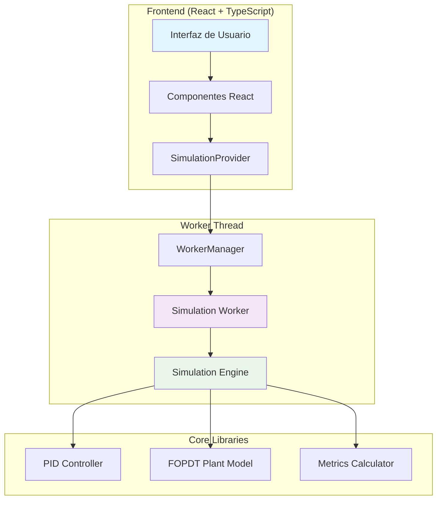

## Patrón Arquitectónico

La aplicación utiliza el **patrón Actor Model** implementado a través de Web Workers para separar la simulación computacionalmente intensiva del hilo principal de la UI.

### Principios de Diseño

1. **Separación de Responsabilidades**: UI, lógica de negocio y simulación están completamente separadas
2. **Comunicación Asíncrona**: Mensajes tipados entre UI y Worker
3. **Estado Inmutable**: El estado se maneja de forma inmutable para evitar efectos secundarios
4. **Tipado Estricto**: TypeScript en toda la aplicación para garantizar seguridad de tipos

## Componentes Principales

### 1. SimulationProvider (Context)

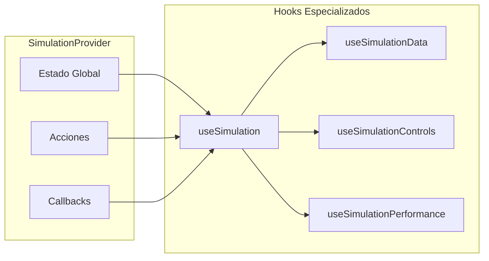

**Responsabilidades:**
- Gestionar el estado global de la simulación
- Proporcionar API limpia para componentes
- Manejar comunicación con WorkerManager
- Gestionar ciclo de vida del Worker

### 2. WorkerManager

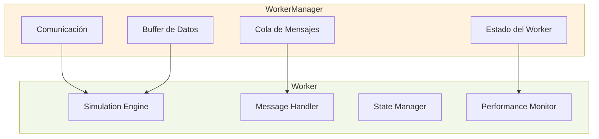

**Responsabilidades:**
- Gestionar comunicación bidireccional con Worker
- Mantener buffer circular de datos
- Procesar cola de mensajes
- Monitorear estado y performance del Worker

### 3. Simulation Worker

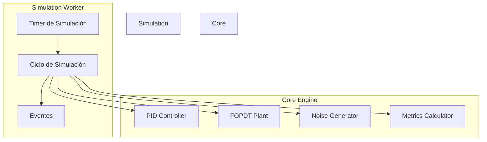

**Responsabilidades:**
- Ejecutar simulación en tiempo real (10 Hz)
- Procesar comandos de la UI
- Calcular respuesta del sistema
- Enviar eventos de datos y métricas

## Flujo de Datos

### Flujo Principal de Simulación

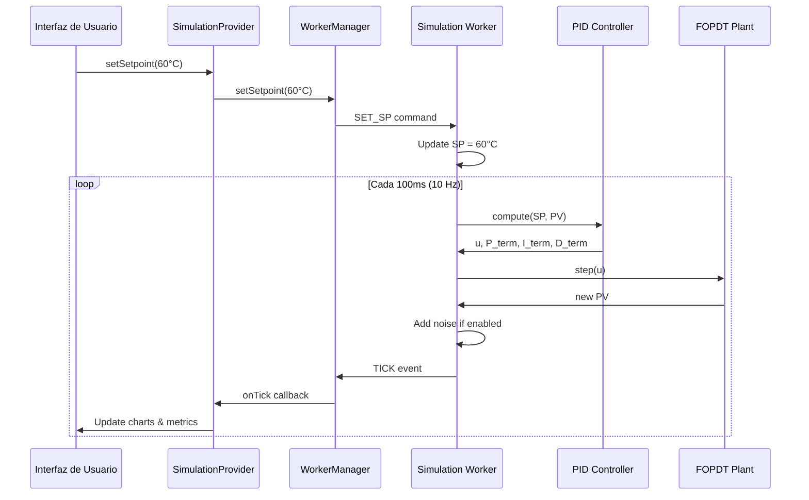

### Flujo de Configuración

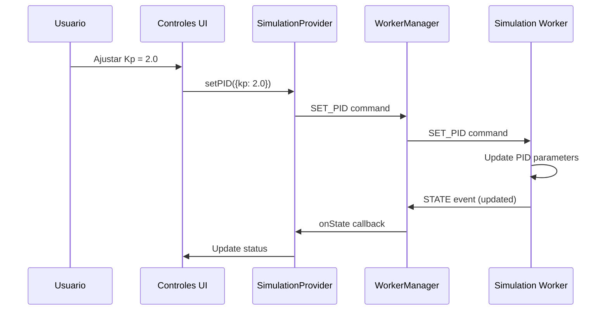

## Estructura de Mensajes

### Contrato de Comunicación

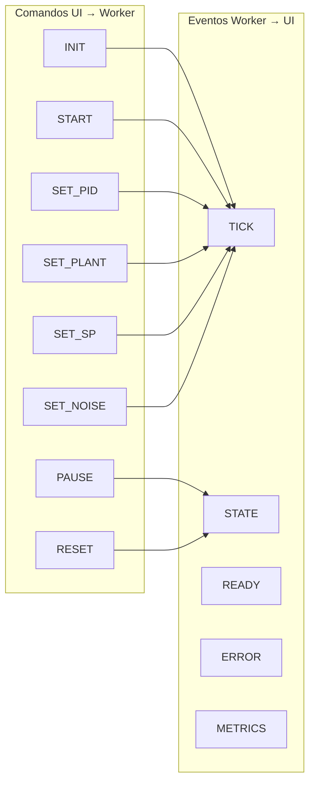

### Estructura de Mensajes

Los mensajes siguen una estructura base que incluye identificador único (UUID), tipo de mensaje, timestamp y payload específico. Se distinguen en comandos (UI → Worker) y eventos (Worker → UI).

## Gestión de Estado

### Estado Global de Simulación

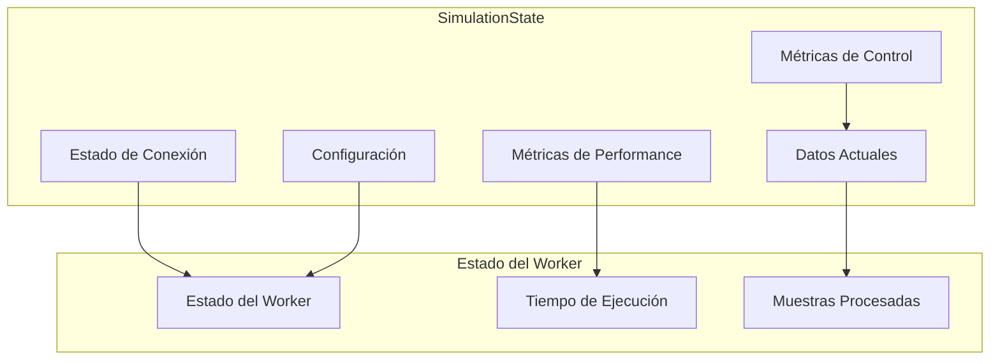

### Buffer de Datos

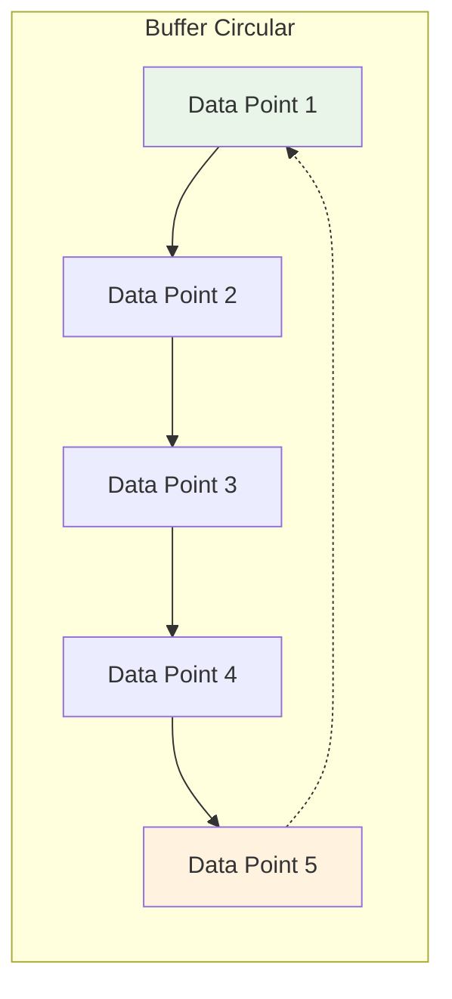

**Características del Buffer:**
- Tamaño configurable (default: 10,000 puntos)
- Implementación FIFO eficiente
- Mantiene últimos N puntos según ventana de tiempo
- Datos tipados con timestamp, SP, PV, u, etc.

## Performance y Optimización

### Estrategias de Optimización

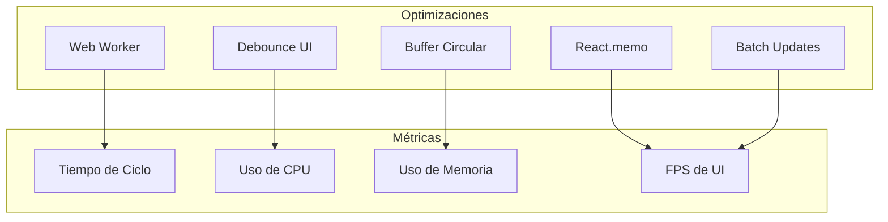

### Monitoreo de Performance

- **Tiempo de Ciclo**: Objetivo < 80ms (10 Hz)
- **Uso de CPU**: Estimación basada en tiempo de ciclo
- **Memoria**: Buffer circular evita crecimiento indefinido
- **FPS de UI**: Objetivo 60 FPS constante

## Configuración y Presets

### Estructura de Configuración

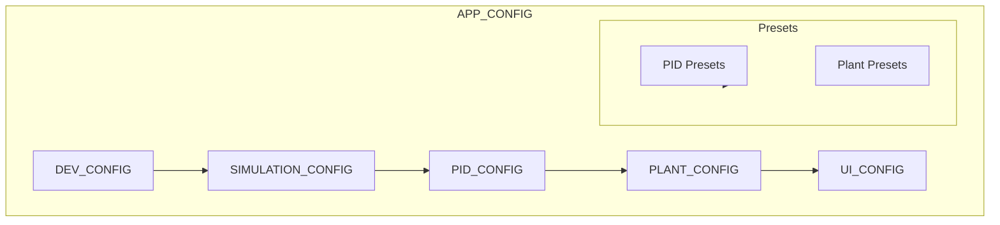

### Presets Disponibles

**PID Presets:**
- Conservador: Respuesta lenta pero estable (Kp=1.0, Ki=0.1, Kd=0.0)
- Balanceado: Respuesta equilibrada (Kp=2.0, Ki=0.2, Kd=5.0)
- Agresivo: Respuesta rápida pero puede oscilar (Kp=5.0, Ki=0.5, Kd=10.0)

**Plant Presets:**
- Horno Industrial: Sistema de gran inercia térmica (τ=360s, L=25s, K=175°C)
- Horno Compacto: Sistema de laboratorio compacto (τ=45s, L=3s, K=75°C)
- Chiller Industrial: Sistema de enfriamiento industrial (τ=90s, L=10s, K=-65°C)

## Seguridad y Robustez

### Manejo de Errores

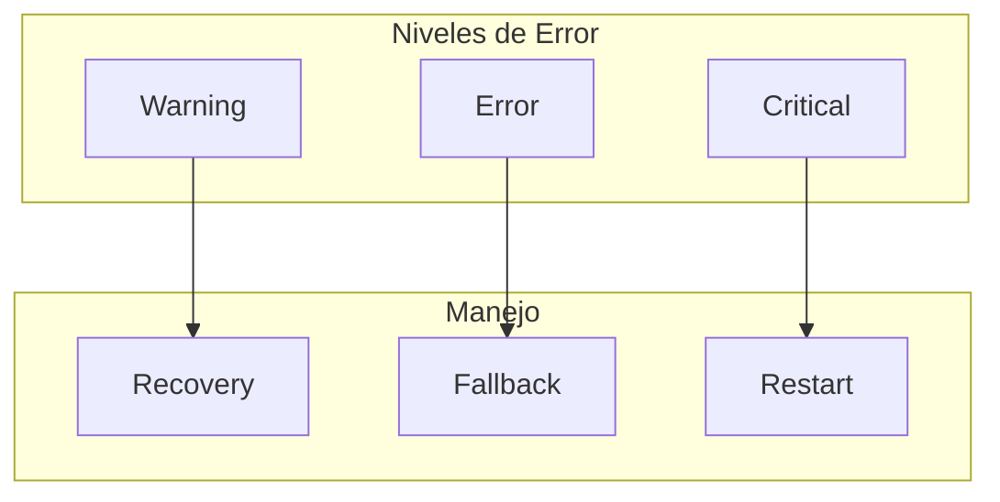

### Estrategias de Recuperación

1. **Warnings**: Log y notificación al usuario
2. **Errors**: Fallback a valores por defecto
3. **Critical**: Reinicio del Worker y reconexión

### Validación de Datos

- Validación de rangos para todos los parámetros
- Sanitización de entrada de usuario
- Verificación de tipos en tiempo de compilación
- Validación de estado del Worker

## Escalabilidad y Mantenibilidad

### Arquitectura Modular

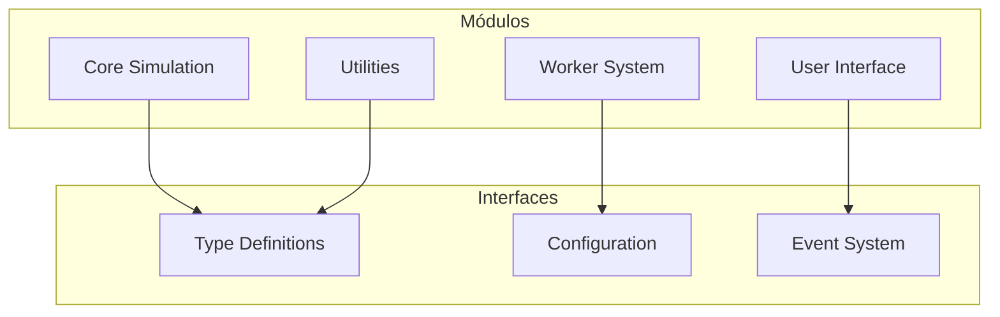

### Extensiones Futuras

- **Múltiples Plantas**: Soporte para sistemas más complejos
- **Algoritmos Avanzados**: MPC, Fuzzy Logic, etc.
- **Análisis Offline**: Procesamiento de datos históricos
- **Integración IoT**: Conexión con dispositivos reales

## Conclusión

La arquitectura del PID Playground está diseñada para ser:

- **Escalable**: Fácil de extender con nuevas funcionalidades
- **Mantenible**: Código bien estructurado y documentado
- **Performance**: Optimizada para simulación en tiempo real
- **Robusta**: Manejo robusto de errores y recuperación
- **Tipada**: Seguridad de tipos en toda la aplicación

Esta arquitectura proporciona una base sólida para el desarrollo futuro y mantenimiento del PID Playground.

---

