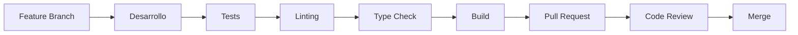

# Guía de Desarrollo - PID Playground

## Visión General

Esta guía proporciona toda la información necesaria para desarrollar y contribuir al PID Playground, incluyendo configuración del entorno, convenciones de código, y procesos de desarrollo.

## Índice

1. [Configuración del Entorno](#configuración-del-entorno)
2. [Estructura del Proyecto](#estructura-del-proyecto)
3. [Convenciones de Código](#convenciones-de-código)
4. [Flujo de Desarrollo](#flujo-de-desarrollo)
5. [Testing](#testing)
6. [Build y Despliegue](#build-y-despliegue)
7. [Debugging](#debugging)
8. [Contribución](#contribución)

## Configuración del Entorno

### Prerequisitos

- **Node.js**: 18.0.0 o superior
- **pnpm**: Gestor de paquetes preferido
- **Git**: Control de versiones
- **Editor**: VS Code recomendado con extensiones

### Instalación Inicial

```bash
# Clonar el repositorio
git clone <repository-url>
cd PID-Playground

# Instalar dependencias
pnpm install

# Verificar instalación
pnpm run lint
pnpm run test
```

## Estructura del Proyecto

### Organización de Directorios

```
src/
├── components/          # Componentes React
│   ├── ui/             # Componentes base (shadcn/ui)
│   ├── customUI/       # Componentes personalizados
│   └── *.tsx           # Componentes específicos
├── lib/                # Utilidades y lógica de negocio
│   ├── simulation/     # Lógica de simulación
│   ├── types.ts        # Tipos globales
│   └── utils.ts        # Utilidades generales
├── pages/              # Páginas de la aplicación
├── config/             # Configuración de la aplicación
├── hooks/              # Hooks personalizados
└── workers/            # Web Workers
```

### Convenciones de Nomenclatura

```typescript
// Archivos y directorios
components/          // kebab-case para directorios
SimulationProvider.tsx  // PascalCase para componentes
use-simulation.ts    // kebab-case para hooks
worker-manager.ts    // kebab-case para utilidades

// Variables y funciones
const simulationState = {}  // camelCase
const handleStateChange = () => {}  // camelCase
const PID_CONFIG = {}  // UPPER_SNAKE_CASE para constantes

// Tipos e interfaces
interface SimulationState {}  // PascalCase
type MessageType = string  // PascalCase
```

## Convenciones de Código

### TypeScript

#### Configuración Estricta

```typescript
// tsconfig.json - Configuración recomendada
{
  "compilerOptions": {
    "strict": true,
    "noImplicitAny": true,
    "noImplicitReturns": true,
    "noUnusedLocals": true,
    "noUnusedParameters": true
  }
}
```

#### Tipado de Props

```typescript
// ✅ Bueno - Props tipadas
interface ComponentProps {
  value: number
  onChange: (value: number) => void
  disabled?: boolean
}

const MyComponent: React.FC<ComponentProps> = ({ value, onChange, disabled = false }) => {
  // ...
}

// ❌ Evitar - Props sin tipar
const MyComponent = (props: any) => {
  // ...
}
```

#### Manejo de Estados

```typescript
// ✅ Bueno - Estado tipado
interface SimulationState {
  isRunning: boolean
  currentValue: number
  error: string | null
}

const [state, setState] = useState<SimulationState>({
  isRunning: false,
  currentValue: 0,
  error: null
})

// ✅ Bueno - Actualizaciones inmutables
setState(prev => ({
  ...prev,
  isRunning: true,
  error: null
}))
```

### React

#### Hooks Personalizados

```typescript
// ✅ Bueno - Hook bien estructurado
export function useSimulation() {
  const [state, setState] = useState<SimulationState>(initialState)
  
  const actions = useMemo(() => ({
    start: () => { /* ... */ },
    pause: () => { /* ... */ },
    reset: () => { /* ... */ }
  }), [])
  
  return { state, actions }
}

// ✅ Bueno - Hook con cleanup
useEffect(() => {
  const subscription = subscribe()
  
  return () => {
    subscription.unsubscribe()
  }
}, [])
```

#### Componentes Funcionales

```typescript
// ✅ Bueno - Componente funcional con memo
const SimulationChart: React.FC<ChartProps> = React.memo(({ data, config }) => {
  const chartRef = useRef<HTMLDivElement>(null)
  
  useEffect(() => {
    if (chartRef.current) {
      // Inicializar gráfica
    }
  }, [])
  
  return <div ref={chartRef} className="chart-container" />
})

SimulationChart.displayName = 'SimulationChart'
```

### CSS y Styling

#### Tailwind CSS

```typescript
// ✅ Bueno - Clases organizadas
const buttonClasses = cn(
  "px-4 py-2 rounded-md font-medium transition-colors",
  "bg-blue-500 hover:bg-blue-600 text-white",
  "disabled:bg-gray-300 disabled:cursor-not-allowed",
  className
)

// ✅ Bueno - Componentes con variantes
const buttonVariants = cva(
  "inline-flex items-center justify-center rounded-md text-sm font-medium transition-colors",
  {
    variants: {
      variant: {
        default: "bg-primary text-primary-foreground hover:bg-primary/90",
        destructive: "bg-destructive text-destructive-foreground hover:bg-destructive/90",
        outline: "border border-input bg-background hover:bg-accent hover:text-accent-foreground"
      },
      size: {
        default: "h-10 px-4 py-2",
        sm: "h-9 rounded-md px-3",
        lg: "h-11 rounded-md px-8"
      }
    },
    defaultVariants: {
      variant: "default",
      size: "default"
    }
  }
)
```

## Flujo de Desarrollo

### Scripts Disponibles

```json
{
  "scripts": {
    "dev": "vite",                    // Servidor de desarrollo
    "build": "vite build",            // Build de producción
    "build:dev": "vite build --mode development", // Build de desarrollo
    "preview": "vite preview",        // Previsualizar build
    "lint": "eslint .",               // Linting
    "lint:fix": "eslint . --fix",     // Linting con auto-fix
    "test": "vitest run",             // Tests unitarios
    "test:ui": "vitest",              // Tests con UI
    "test:coverage": "vitest run --coverage", // Tests con cobertura
    "type-check": "tsc --noEmit"      // Verificación de tipos
  }
}
```

### Workflow de Desarrollo



### Git Workflow

```bash
# 1. Crear rama de feature
git checkout -b feature/nueva-funcionalidad

# 2. Desarrollo
# ... hacer cambios ...

# 3. Commit con mensaje descriptivo
git add .
git commit -m "feat: añadir nueva funcionalidad de exportación

- Implementar exportación a CSV
- Añadir opciones de formato
- Incluir metadatos en exportación"

# 4. Push y crear PR
git push origin feature/nueva-funcionalidad
```

### Convenciones de Commits

```bash
# Formato: tipo(scope): descripción

# Tipos principales
feat: nueva funcionalidad
fix: corrección de bug
docs: documentación
style: cambios de formato
refactor: refactorización
test: añadir o modificar tests
chore: tareas de mantenimiento

# Ejemplos
feat(simulation): añadir soporte para múltiples plantas
fix(ui): corregir renderizado de gráficas en modo oscuro
docs(api): actualizar documentación de WorkerManager
refactor(pid): simplificar cálculo de anti-windup
```

## Testing

### Configuración de Tests

```typescript
// vitest.config.ts
import { defineConfig } from 'vitest/config'
import react from '@vitejs/plugin-react-swc'

export default defineConfig({
  plugins: [react()],
  test: {
    environment: 'jsdom',
    setupFiles: ['tests/setup.ts'],
    globals: true,
    coverage: {
      provider: 'v8',
      reporter: ['text', 'json', 'html'],
      exclude: [
        'node_modules/',
        'tests/',
        '**/*.d.ts',
        '**/*.config.*'
      ]
    }
  }
})
```

### Estructura de Tests

```typescript
// tests/setup.ts
import '@testing-library/jest-dom'
import { vi } from 'vitest'

// Mock de Web Workers
global.Worker = vi.fn().mockImplementation(() => ({
  postMessage: vi.fn(),
  addEventListener: vi.fn(),
  removeEventListener: vi.fn(),
  terminate: vi.fn()
}))

// Mock de performance.now()
global.performance = {
  now: vi.fn(() => Date.now())
}
```

### Ejemplos de Tests

```typescript
// tests/pid-controller.test.ts
import { describe, it, expect, beforeEach } from 'vitest'
import { PIDController } from '@/lib/simulation/pid-controller'

describe('PIDController', () => {
  let controller: PIDController

  beforeEach(() => {
    controller = new PIDController({
      kp: 1.0,
      ki: 0.1,
      kd: 0.0
    }, 0.1)
  })

  it('should calculate correct output for step input', () => {
    const setpoint = 100
    const processVariable = 50
    
    const output = controller.compute(setpoint, processVariable)
    
    expect(output.u).toBeGreaterThan(0)
    expect(output.P_term).toBe(50) // kp * error
  })

  it('should handle saturation correctly', () => {
    controller.updateParameters({ kp: 1000, ki: 0, kd: 0 })
    
    const output = controller.compute(100, 0)
    
    expect(output.u).toBe(1.0) // Saturado al máximo
    expect(output.saturated).toBe(true)
  })
})
```

### Tests de Componentes

```typescript
// tests/components/SimulationProvider.test.tsx
import { render, screen, waitFor } from '@testing-library/react'
import { SimulationProvider } from '@/components/SimulationProvider'

describe('SimulationProvider', () => {
  it('should initialize worker on mount', async () => {
    render(
      <SimulationProvider>
        <div>Test Component</div>
      </SimulationProvider>
    )

    await waitFor(() => {
      expect(screen.getByText('Test Component')).toBeInTheDocument()
    })
  })

  it('should handle worker errors gracefully', async () => {
    // Mock worker error
    const mockWorker = {
      postMessage: vi.fn(),
      addEventListener: vi.fn((event, callback) => {
        if (event === 'error') {
          callback(new ErrorEvent('error', { message: 'Worker error' }))
        }
      }),
      terminate: vi.fn()
    }
    
    global.Worker = vi.fn(() => mockWorker)

    render(
      <SimulationProvider>
        <div>Test Component</div>
      </SimulationProvider>
    )

    // Verificar que el error se maneja correctamente
    await waitFor(() => {
      expect(mockWorker.addEventListener).toHaveBeenCalled()
    })
  })
})
```

## Build y Despliegue

### Configuración de Build

```typescript
// vite.config.ts
import { defineConfig } from 'vite'
import react from '@vitejs/plugin-react-swc'
import path from 'path'

export default defineConfig({
  plugins: [react()],
  resolve: {
    alias: {
      '@': path.resolve(__dirname, './src')
    }
  },
  build: {
    outDir: 'dist',
    sourcemap: true,
    rollupOptions: {
      output: {
        manualChunks: {
          vendor: ['react', 'react-dom'],
          simulation: ['@/lib/simulation']
        }
      }
    }
  },
  worker: {
    format: 'es'
  }
})
```

### Optimizaciones de Build

```typescript
// Optimizaciones recomendadas
export default defineConfig({
  build: {
    // Compresión
    minify: 'terser',
    terserOptions: {
      compress: {
        drop_console: true,
        drop_debugger: true
      }
    },
    
    // Chunking inteligente
    rollupOptions: {
      output: {
        manualChunks: {
          'react-vendor': ['react', 'react-dom'],
          'ui-components': ['@/components/ui'],
          'simulation-core': ['@/lib/simulation']
        }
      }
    },
    
    // Análisis de bundle
    reportCompressedSize: true
  }
})
```

### Despliegue

```bash
# Build de producción
pnpm run build

# Verificar build
pnpm run preview

# Desplegar (ejemplo con Netlify)
netlify deploy --prod --dir=dist
```

## Debugging

### Configuración de Debug

```json
// .vscode/launch.json
{
  "version": "0.2.0",
  "configurations": [
    {
      "name": "Debug React App",
      "type": "chrome",
      "request": "launch",
      "url": "http://localhost:8082",
      "webRoot": "${workspaceFolder}/src",
      "sourceMapPathOverrides": {
        "webpack:///src/*": "${webRoot}/*"
      }
    },
    {
      "name": "Debug Tests",
      "type": "node",
      "request": "launch",
      "program": "${workspaceFolder}/node_modules/vitest/vitest.mjs",
      "args": ["run", "--reporter=verbose"],
      "console": "integratedTerminal"
    }
  ]
}
```

### Debugging del Worker

```typescript
// Habilitar debug mode
const manager = new WorkerManager({
  debugMode: true,
  timestep: 0.1
})

// Logs detallados
manager.setCallbacks({
  onTick: (data) => {
    console.log('Tick data:', data)
  },
  onError: (error) => {
    console.error('Worker error:', error)
  }
})
```

### Herramientas de Debug

```typescript
// React DevTools
// Instalar extensión del navegador para inspeccionar componentes

// Redux DevTools (si se usa)
// Configurar para inspeccionar estado

// Performance Profiling
const performanceObserver = new PerformanceObserver((list) => {
  for (const entry of list.getEntries()) {
    console.log('Performance entry:', entry)
  }
})

performanceObserver.observe({ entryTypes: ['measure'] })
```

## Contribución

### Proceso de Contribución

1. **Fork del repositorio**
2. **Crear rama de feature**
3. **Desarrollo con tests**
4. **Linting y type checking**
5. **Pull Request con descripción detallada**
6. **Code review**
7. **Merge después de aprobación**

### Checklist de PR

- [ ] Tests pasando
- [ ] Linting sin errores
- [ ] Type checking sin errores
- [ ] Documentación actualizada
- [ ] Build exitoso
- [ ] Descripción clara del cambio

### Estándares de Código

```typescript
// ✅ Documentación de funciones
/**
 * Calcula la respuesta del controlador PID
 * @param setpoint - Valor deseado
 * @param processVariable - Valor actual del proceso
 * @returns Objeto con salida de control y componentes
 */
function computePID(setpoint: number, processVariable: number): PIDOutput {
  // Implementación
}

// ✅ Manejo de errores
function safeOperation() {
  try {
    // Operación riesgosa
  } catch (error) {
    console.error('Error en operación:', error)
    throw new Error('Operación falló')
  }
}

// ✅ Validación de entrada
function validateInput(value: number, min: number, max: number): boolean {
  return value >= min && value <= max
}
```

### Documentación de Cambios

```markdown
## Descripción
Añadir soporte para exportación de datos en múltiples formatos

## Cambios
- Implementar exportación CSV
- Añadir exportación JSON
- Incluir metadatos en exportación

## Testing
- [x] Tests unitarios para exportación
- [x] Tests de integración
- [x] Verificación de formato de salida

## Breaking Changes
Ninguno

## Screenshots
[Incluir capturas si aplica]
```

## Conclusión

Esta guía proporciona las bases para desarrollar efectivamente en el PID Playground. Siguiendo estas convenciones y procesos, se asegura la calidad del código y la mantenibilidad del proyecto.

Para preguntas específicas o clarificaciones, consulta la documentación técnica o crea un issue en el repositorio.

---
