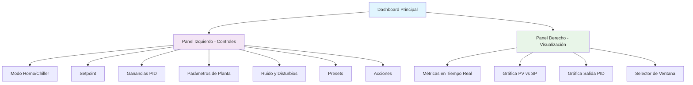
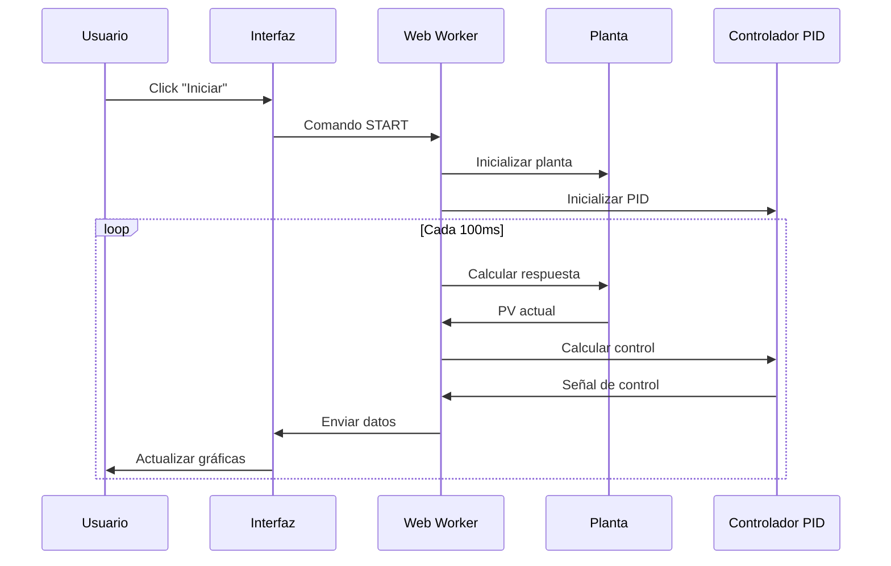
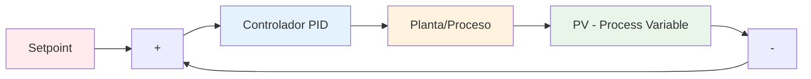
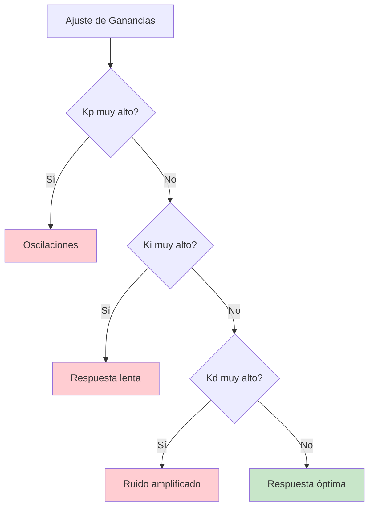
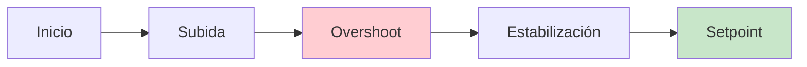
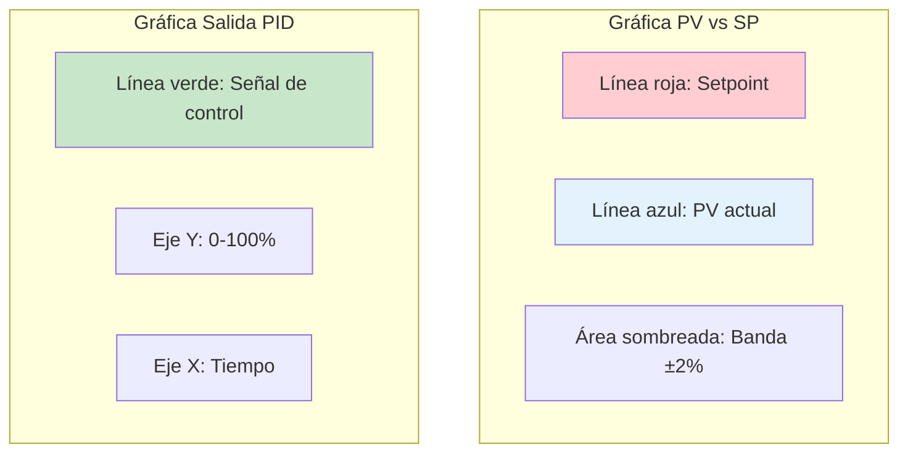
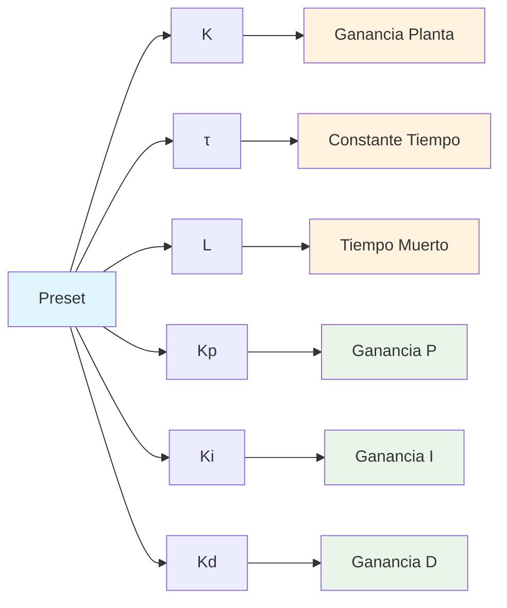

# 🚀 Guía de Inicio Rápido - PID Playground

> **Tiempo estimado**: 5 minutos  
> **Nivel**: Principiante  
> **Objetivo**: Configurar y ejecutar tu primera simulación PID

---

## 📋 ¿Qué es el PID Playground?

El **PID Playground — Horno/Chiller** es una aplicación web que simula en tiempo real la respuesta térmica de un sistema (horno o chiller) controlado por un algoritmo PID ajustable.

### 🎯 ¿Para qué sirve?

- **Aprender control PID** sin tocar hardware real
- **Ajustar ganancias** antes de implementar en sistemas físicos
- **Analizar respuestas** del sistema con métricas en tiempo real
- **Experimentar** con diferentes configuraciones y disturbios

---

## 🔧 Instalación y Configuración

### Prerequisitos
- **Navegador web** moderno (Chrome, Firefox, Safari, Edge)
- **Node.js 18+** (para desarrollo local)
- **pnpm** (gestor de paquetes preferido)

### Instalación Local (Opcional)

```bash
# Clonar el repositorio
git clone <YOUR_GIT_URL>
cd PID-Playground

# Instalar dependencias
pnpm install

# Iniciar servidor de desarrollo
pnpm dev
```

### Acceso Directo
Si no quieres instalar nada, puedes acceder directamente a la aplicación web en: `https://pid-playground.triptalabs.com.co`

---

## 🎮 Interfaz Básica

La interfaz del simulador está dividida en dos paneles principales:



### Panel de Controles (Izquierda)

| Control | Descripción | Rango |
|---------|-------------|-------|
| **Modo** | Horno (calentar) o Chiller (enfriar) | Horno/Chiller |
| **Setpoint** | Temperatura objetivo | 0-200°C |
| **Kp** | Ganancia proporcional | 0-10 |
| **Ki** | Ganancia integral | 0-1 s⁻¹ |
| **Kd** | Tiempo derivativo | 0-200 s |
| **K** | Ganancia de la planta | -100 a 200 |
| **τ** | Constante de tiempo | 1-600 s |
| **L** | Tiempo muerto | 0-60 s |

### Panel de Visualización (Derecha)

- **Métricas**: Overshoot (%) y Tiempo de establecimiento (s)
- **Gráficas**: PV vs SP y Salida del PID
- **Ventana temporal**: 30s, 60s, 300s

---

## 🎯 Tu Primera Simulación

### Paso 1: Configuración Inicial

1. **Selecciona el modo**: Horno (para calentar)
2. **Establece el setpoint**: 60°C
3. **Usa presets**: Selecciona "Horno Compacto" para empezar

### Paso 2: Iniciar Simulación



### Paso 3: Observar Resultados

Deberías ver:
- **Gráfica PV vs SP**: La temperatura del proceso (línea azul) acercándose al setpoint (línea roja)
- **Gráfica Salida PID**: La señal de control (0-100%)
- **Métricas**: Overshoot y tiempo de establecimiento

---

## 📊 Conceptos Básicos de PID

### ¿Qué es un Controlador PID?

Un controlador PID es un algoritmo que ajusta automáticamente una variable de control basándose en el error entre el valor deseado (setpoint) y el valor actual (PV).



### Componentes del PID

| Componente | Función | Efecto |
|------------|---------|--------|
| **P (Proporcional)** | Respuesta inmediata al error | Velocidad de respuesta |
| **I (Integral)** | Elimina error estacionario | Precisión a largo plazo |
| **D (Derivativo)** | Anticipa cambios | Reduce oscilaciones |

### Efecto de las Ganancias



---

## 🔍 Análisis de Respuesta

### Métricas Importantes

#### Overshoot (%)
Porcentaje que la respuesta excede el setpoint antes de estabilizarse.



#### Tiempo de Establecimiento (tₛ)
Tiempo que tarda en entrar y permanecer dentro del ±2% del setpoint.

### Interpretación de Gráficas



---

## ⚙️ Configuraciones Predefinidas

### Presets Disponibles

| Preset | Descripción | Uso Recomendado |
|--------|-------------|-----------------|
| **Horno Industrial** | Sistema con inercia térmica alta (τ=360s, L=25s) | Sistemas grandes y lentos |
| **Horno Compacto** | Respuesta equilibrada (τ=45s, L=3s) | Experimentación general |
| **Chiller Industrial** | Sistema de enfriamiento (τ=90s, L=10s) | Control de temperatura baja |

### Parámetros por Defecto



---

## 🎮 Experimentos Rápidos

### Experimento 1: Efecto de Kp

1. **Configuración**: Horno Compacto, setpoint 60°C
2. **Variar Kp**: 1 → 2 → 5 → 10
3. **Observar**: Velocidad de respuesta y overshoot

### Experimento 2: Efecto de Ki

1. **Configuración**: Horno Compacto, setpoint 60°C
2. **Variar Ki**: 0.05 → 0.1 → 0.2 → 0.5
3. **Observar**: Eliminación del error estacionario

### Experimento 3: Efecto de Kd

1. **Configuración**: Horno Compacto, setpoint 60°C
2. **Variar Kd**: 5 → 10 → 20 → 50
3. **Observar**: Reducción de oscilaciones

---

## 🚨 Solución de Problemas Comunes

### La simulación no responde
- ✅ Verificar que está en modo "Iniciado"
- ✅ Comprobar que el setpoint es diferente a la temperatura inicial
- ✅ Revisar que las ganancias no sean todas cero

### Oscilaciones excesivas
- ✅ Reducir Kp
- ✅ Aumentar Kd
- ✅ Verificar que Ki no sea muy alto

### Respuesta muy lenta
- ✅ Aumentar Kp
- ✅ Reducir Kd
- ✅ Verificar que Ki no sea muy bajo

### Error estacionario
- ✅ Aumentar Ki
- ✅ Verificar que el modo (horno/chiller) sea correcto

---

## 📚 Próximos Pasos

Ahora que has completado esta guía, puedes:

1. **Explorar los tutoriales** para conceptos más avanzados
2. **Probar los ejemplos** con configuraciones predefinidas
3. **Experimentar** con diferentes parámetros
4. **Consultar el FAQ** si tienes dudas

### Recursos Adicionales

- [Tutorial 1: Conceptos Básicos de PID](./tutorials/01-basic-pid.md)
- [Tutorial 2: Ajuste de Ganancias](./tutorials/02-tuning.md)
- [Ejemplos Prácticos](./examples/)
- [FAQ](./faq.md)

---
