# Tutorial 1: Conceptos Básicos de PID

> **Tiempo estimado**: 15 minutos  
> **Nivel**: Principiante  
> **Prerequisitos**: [Guía de Inicio Rápido](../getting-started.md)

---

## Objetivos del Tutorial

Al finalizar este tutorial, comprenderás:

- ✅ **Qué es un controlador PID** y cómo funciona
- ✅ **Los tres componentes** (P, I, D) y sus efectos
- ✅ **Cómo interpretar** las respuestas del sistema
- ✅ **Cuándo usar** cada tipo de control

---

## ¿Qué es el Control PID?

### Definición

**PID** significa **Proporcional-Integral-Derivativo**. Es un algoritmo de control que ajusta automáticamente una variable de salida basándose en el error entre el valor deseado y el valor actual.

### Analogía Simple

Imagina que estás conduciendo un coche hacia un destino:

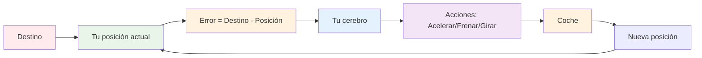

- **P (Proporcional)**: "Estoy lejos del destino, debo acelerar más"
- **I (Integral)**: "He estado lejos por mucho tiempo, necesito más esfuerzo"
- **D (Derivativo)**: "Me estoy acercando muy rápido, debo frenar"

---

## Los Tres Componentes del PID

### 1. Control Proporcional (P)

**Función**: Respuesta inmediata y proporcional al error actual.

**Fórmula**: `P = Kp × e(t)`

Donde:
- `Kp` = Ganancia proporcional
- `e(t)` = Error en el tiempo t

```mermaid
graph LR
    A[Error e(t)] --> B[× Kp]
    B --> C[Señal Proporcional]
    
    style A fill:#ffebee
    style B fill:#e3f2fd
    style C fill:#c8e6c9
```

**Efectos**:
- ✅ **Ventaja**: Respuesta rápida
- ❌ **Desventaja**: Error estacionario (no llega exactamente al setpoint)

### 2. Control Integral (I)

**Función**: Acumula el error a lo largo del tiempo para eliminar el error estacionario.

**Fórmula**: `I = Ki × ∫e(t)dt`

Donde:
- `Ki` = Ganancia integral
- `∫e(t)dt` = Integral del error

```mermaid
graph LR
    A[Error e(t)] --> B[Integrador]
    B --> C[× Ki]
    C --> D[Señal Integral]
    
    style A fill:#ffebee
    style B fill:#fff3e0
    style C fill:#e3f2fd
    style D fill:#c8e6c9
```

**Efectos**:
- ✅ **Ventaja**: Elimina error estacionario
- ❌ **Desventaja**: Respuesta más lenta, puede causar oscilaciones

### 3. Control Derivativo (D)

**Función**: Anticipa cambios basándose en la velocidad de cambio del error.

**Fórmula**: `D = Kd × de(t)/dt`

Donde:
- `Kd` = Ganancia derivativa
- `de(t)/dt` = Derivada del error

```mermaid
graph LR
    A[Error e(t)] --> B[Derivador]
    B --> C[× Kd]
    C --> D[Señal Derivativa]
    
    style A fill:#ffebee
    style B fill:#fff3e0
    style C fill:#e3f2fd
    style D fill:#c8e6c9
```

**Efectos**:
- ✅ **Ventaja**: Reduce oscilaciones, mejora estabilidad
- ❌ **Desventaja**: Amplifica ruido

---

## Combinación de Componentes

### Fórmula PID Completa

```mermaid
graph LR
    A[Error e(t)] --> B[P: Kp × e(t)]
    A --> C[I: Ki × ∫e(t)dt]
    A --> D[D: Kd × de/dt]
    
    B --> E[+]
    C --> E
    D --> F[-]
    E --> G[+]
    F --> G
    G --> H[Señal de Control u(t)]
    
    style A fill:#ffebee
    style B fill:#e3f2fd
    style C fill:#fff3e0
    style D fill:#f3e5f5
    style H fill:#c8e6c9
```

**Fórmula matemática**:
```
u(t) = Kp × e(t) + Ki × ∫e(t)dt + Kd × de(t)/dt
```

### Efectos Combinados

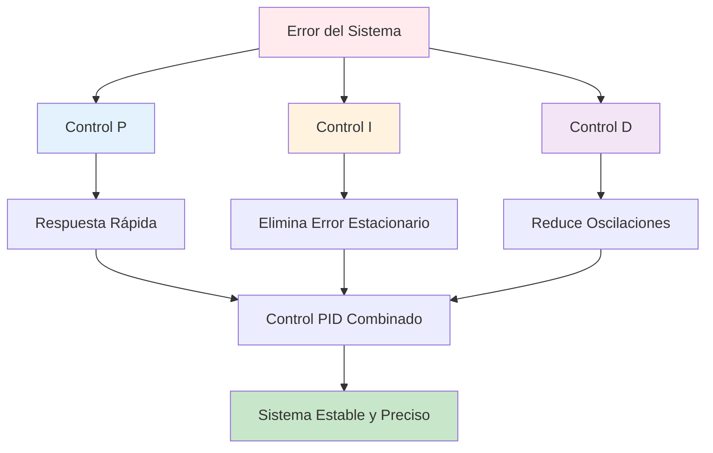

---

## Tipos de Respuesta del Sistema

### 1. Respuesta Subamortiguada

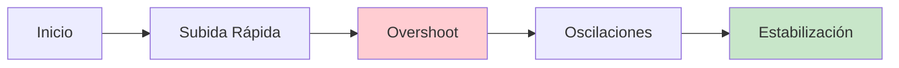

**Características**:
- Respuesta rápida
- Overshoot presente
- Oscilaciones que se amortiguan

**Causa**: Kp alto, Kd bajo

### 2. Respuesta Sobreamortiguada

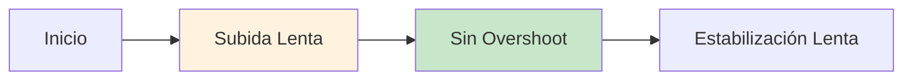

**Características**:
- Respuesta lenta
- Sin overshoot
- Estabilización gradual

**Causa**: Kp bajo, Kd alto

### 3. Respuesta Críticamente Amortiguada

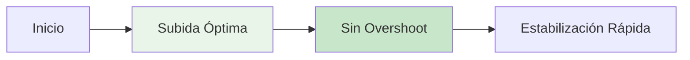

**Características**:
- Respuesta equilibrada
- Sin overshoot
- Estabilización rápida

**Causa**: Ganancias balanceadas

---

## Experimentos Prácticos

### Experimento 1: Solo Control P

**Configuración**:
- Ki = 0, Kd = 0
- Kp = 2.0
- Setpoint = 60°C

**Observaciones**:
- Respuesta rápida
- Error estacionario presente
- Sin oscilaciones

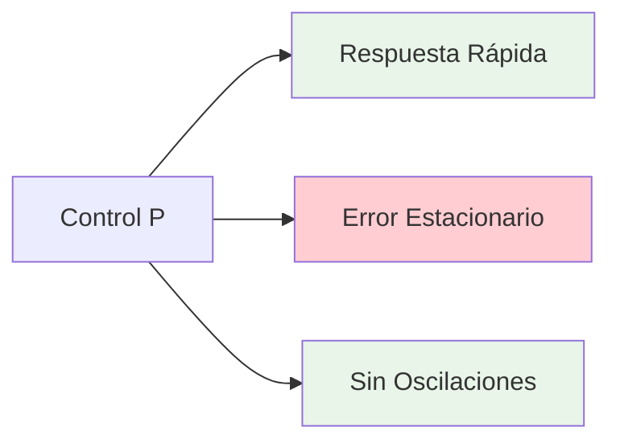

### Experimento 2: Control PI

**Configuración**:
- Kp = 2.0, Ki = 0.1, Kd = 0
- Setpoint = 60°C

**Observaciones**:
- Error estacionario eliminado
- Posibles oscilaciones
- Respuesta más lenta

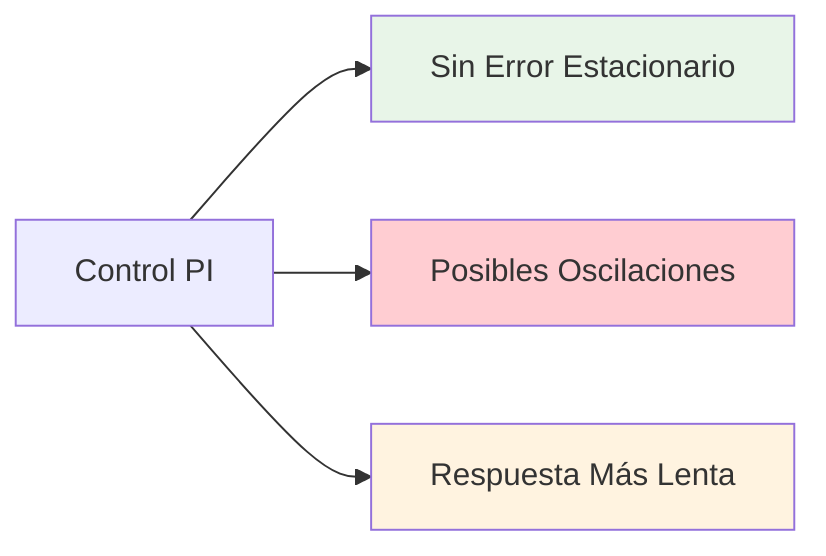

### Experimento 3: Control PID Completo

**Configuración**:
- Kp = 2.0, Ki = 0.1, Kd = 10
- Setpoint = 60°C

**Observaciones**:
- Respuesta equilibrada
- Sin error estacionario
- Oscilaciones reducidas

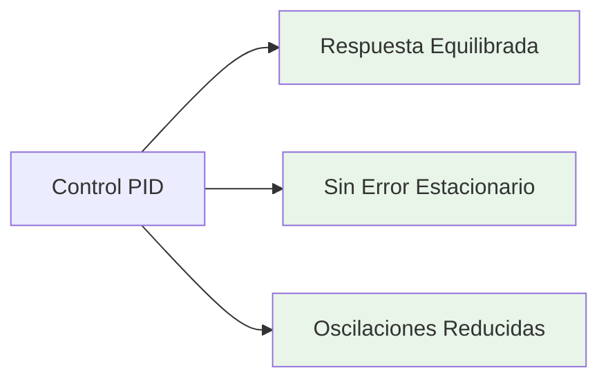

---

## Ajuste de Ganancias

### Reglas Básicas de Tuning

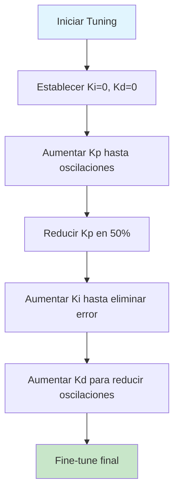

### Efectos de Cambiar Ganancias

| Ganancia | Aumentar | Disminuir |
|----------|----------|-----------|
| **Kp** | Respuesta más rápida, más overshoot | Respuesta más lenta, menos overshoot |
| **Ki** | Error estacionario menor, más oscilaciones | Error estacionario mayor, menos oscilaciones |
| **Kd** | Menos oscilaciones, más ruido | Más oscilaciones, menos ruido |

---

## Casos de Uso Comunes

### 1. Control de Temperatura (Horno)

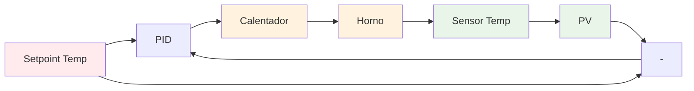

**Características**:
- Respuesta lenta (inercia térmica)
- Tiempo muerto presente
- Control PID ideal

### 2. Control de Velocidad (Motor)

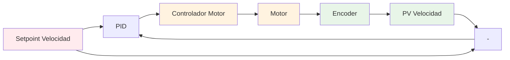

**Características**:
- Respuesta rápida
- Poca inercia
- Control P o PI suficiente

### 3. Control de Nivel (Tanque)

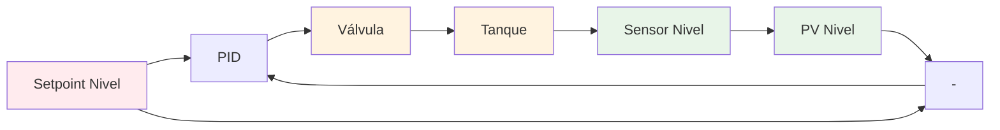

**Características**:
- Respuesta muy lenta
- Integrador natural
- Control PI ideal

---

## Problemas Comunes y Soluciones

### 1. Oscilaciones Excesivas

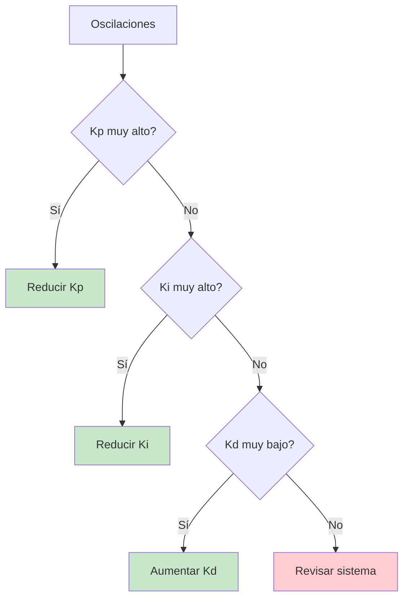

### 2. Respuesta Muy Lenta

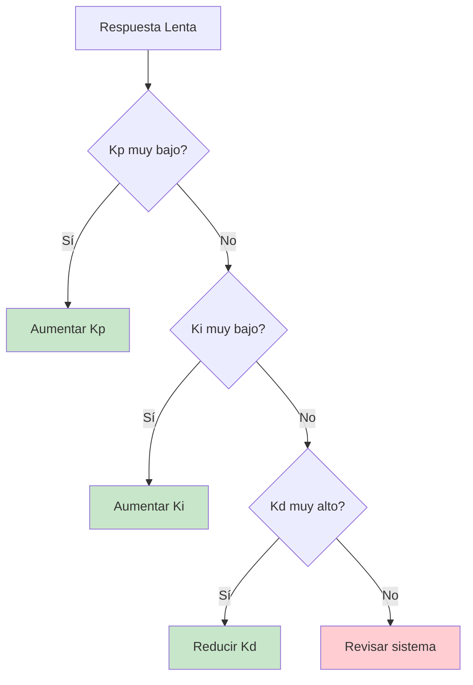

### 3. Error Estacionario

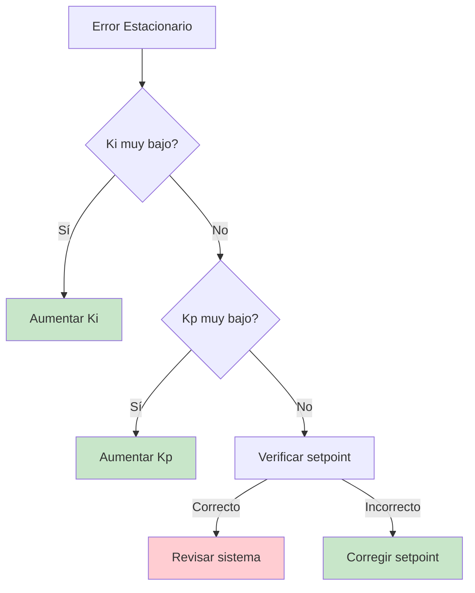

---

## Resumen

### Conceptos Clave

1. **PID** = Proporcional + Integral + Derivativo
2. **P**: Respuesta inmediata al error
3. **I**: Elimina error estacionario
4. **D**: Reduce oscilaciones y mejora estabilidad

### Fórmula Principal

```
u(t) = Kp × e(t) + Ki × ∫e(t)dt + Kd × de(t)/dt
```

### Reglas de Tuning

1. **Empezar con P** (Ki=0, Kd=0)
2. **Añadir I** para eliminar error estacionario
3. **Añadir D** para reducir oscilaciones
4. **Fine-tune** para optimizar

---

## Próximos Pasos

Ahora que comprendes los conceptos básicos, puedes:

1. **Practicar** con diferentes configuraciones en el simulador
2. **Experimentar** con los presets predefinidos
3. **Aprender** técnicas avanzadas de tuning
4. **Explorar** casos de uso específicos

### Recursos Adicionales

- [Tutorial 2: Ajuste de Ganancias](./02-tuning.md)
- [Ejemplos Prácticos](../examples/)
- [FAQ](../faq.md)

---

Has completado el tutorial básico de PID. Ahora tienes una comprensión sólida de cómo funcionan los controladores PID y cómo ajustar sus parámetros.

**Siguiente**: [Tutorial 2: Ajuste de Ganancias](./02-tuning.md)

---
