# Tutorial 2: Ajuste de Ganancias PID

> **Tiempo estimado**: 20 minutos  
> **Nivel**: Intermedio  
> **Prerequisitos**: [Tutorial 1: Conceptos Básicos de PID](./01-basic-pid.md)

---

## Objetivos del Tutorial

Al finalizar este tutorial, dominarás:

- ✅ **Métodos sistemáticos** de tuning PID
- ✅ **Técnicas de Ziegler-Nichols** y variaciones
- ✅ **Optimización de parámetros** para diferentes sistemas
- ✅ **Diagnóstico y corrección** de problemas de control

---

## ¿Por qué es Importante el Tuning?

### El Problema del Tuning

Un controlador PID mal ajustado puede causar:

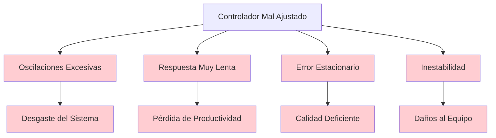

### Beneficios del Tuning Correcto

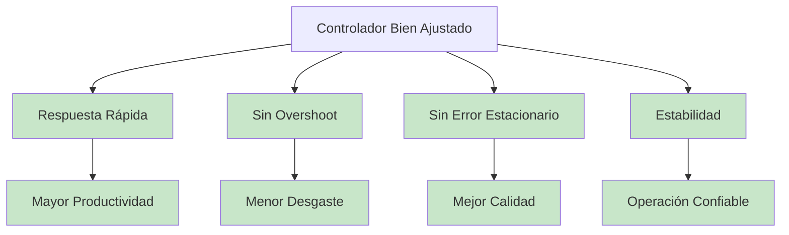

---

## Métodos de Tuning

### 1. Método de Ziegler-Nichols (Clásico)

El método más conocido y ampliamente utilizado para sistemas de primer orden con tiempo muerto.

#### Fase 1: Identificación del Sistema


#### Fase 2: Determinación de Ganancias Críticas

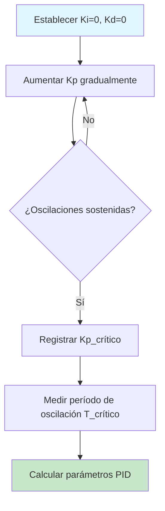

#### Fórmulas de Ziegler-Nichols

| Control | Kp | Ti | Td |
|---------|----|----|----|
| **P** | 0.5 × Kp_cr | - | - |
| **PI** | 0.45 × Kp_cr | 0.83 × T_cr | - |
| **PID** | 0.6 × Kp_cr | 0.5 × T_cr | 0.125 × T_cr |

### 2. Método de Cohen-Coon

Variación del método Z-N que considera la relación L/τ.


#### Fórmulas de Cohen-Coon

**Para Control PI**:
```
Kp = (τ/KL) × [0.9 + L/(12τ)]
Ti = L × [30 + 3(L/τ)] / [9 + 20(L/τ)]
```

**Para Control PID**:
```
Kp = (τ/KL) × [1.35 + L/(4τ)]
Ti = L × [32 + 6(L/τ)] / [13 + 8(L/τ)]
Td = L × 4 / [11 + 2(L/τ)]
```

### 3. Método de Respuesta al Escalón

Método más simple que no requiere oscilaciones críticas.

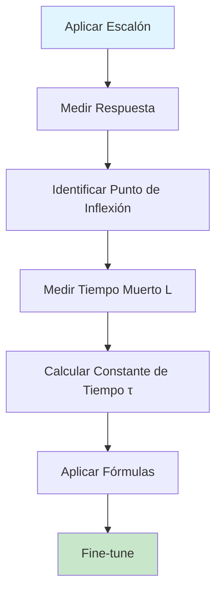

---

## Técnicas de Tuning Práctico

### Técnica 1: Tuning Secuencial

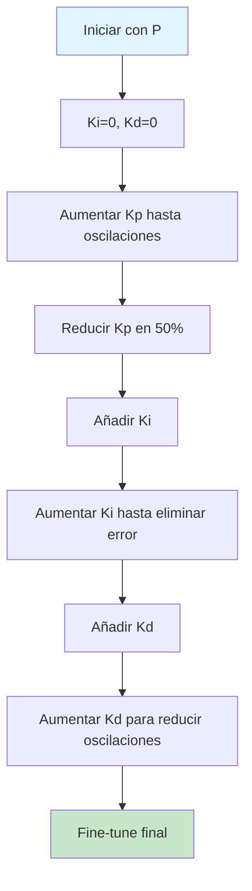

### Técnica 2: Tuning por Ensayo y Error

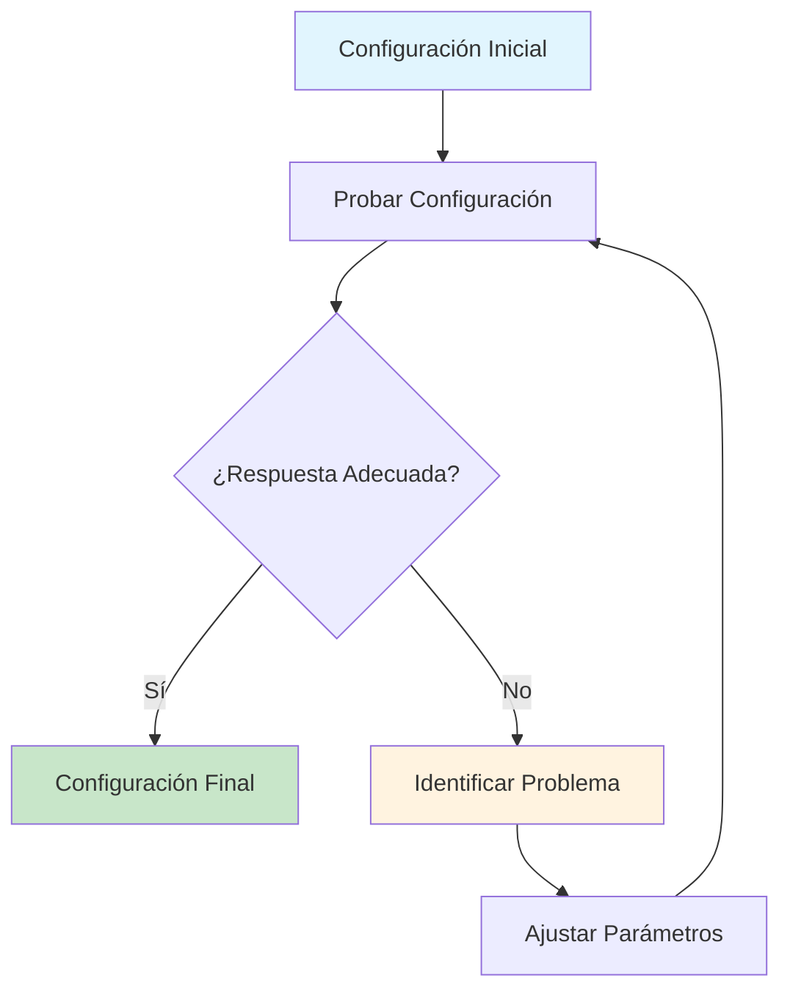

### Técnica 3: Tuning por Reglas Heurísticas

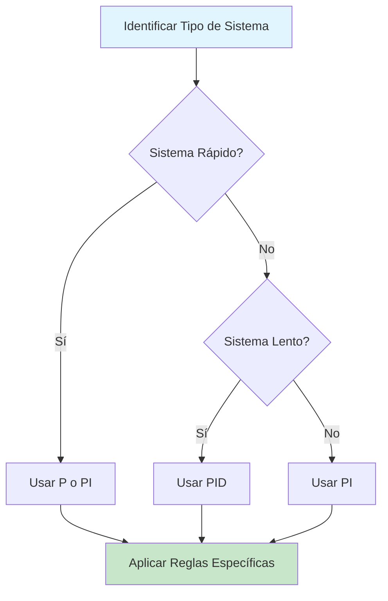

---

## Criterios de Optimización

### 1. Criterios de Rendimiento

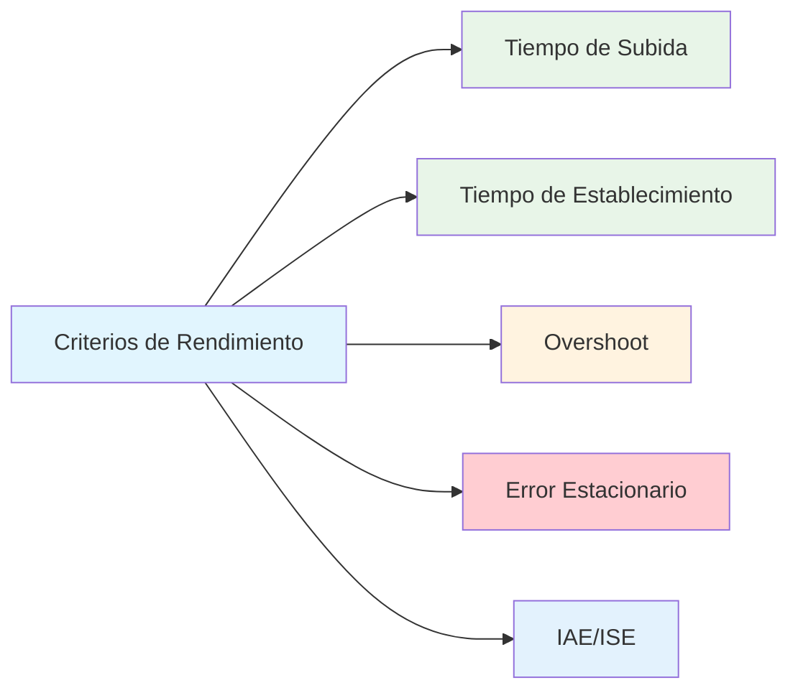

### 2. Compromisos en el Tuning

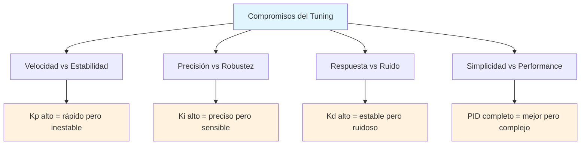

---

## Tuning para Diferentes Tipos de Sistemas

### 1. Sistemas de Primer Orden (FOPDT)

```mermaid
graph LR
    A[Sistema FOPDT] --> B[G(s) = K/(τs+1) × e^(-Ls)]
    B --> C[Identificar K, τ, L]
    C --> D[Aplicar Ziegler-Nichols]
    D --> E[Fine-tune]
    
    style A fill:#e1f5fe
    style E fill:#c8e6c9
```

**Reglas de Tuning**:
- **Kp**: 0.5-2.0 × (τ/KL)
- **Ki**: 0.1-0.5 × Kp/τ
- **Kd**: 0.1-0.5 × Kp × τ

### 2. Sistemas de Segundo Orden

```mermaid
graph LR
    A[Sistema 2do Orden] --> B[G(s) = K/(s² + 2ζωs + ω²)]
    B --> C[Identificar ζ, ω]
    C --> D[ζ < 0.7: PID]
    D --> E[ζ > 0.7: PI]
    
    style A fill:#e1f5fe
    style E fill:#c8e6c9
```

### 3. Sistemas Integradores

```mermaid
graph LR
    A[Sistema Integrador] --> B[G(s) = K/s]
    B --> C[Usar Control PI]
    C --> D[Kp = 0.5-1.0]
    D --> E[Ki = 0.1-0.3]
    
    style A fill:#e1f5fe
    style E fill:#c8e6c9
```

---

## Técnicas de Fine-tuning

### 1. Ajuste de Overshoot

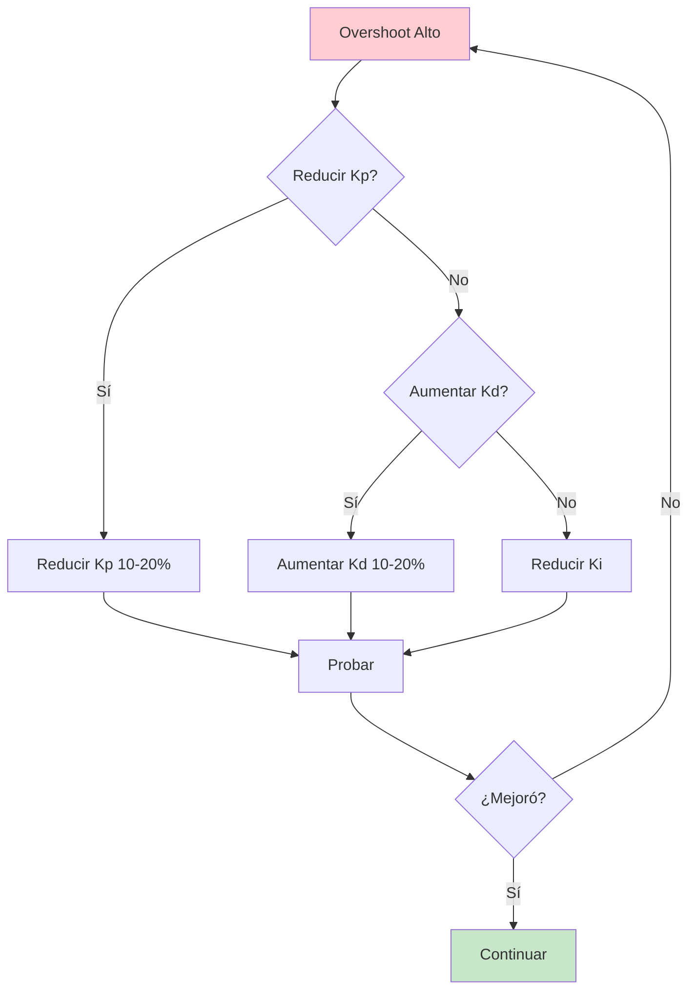

### 2. Ajuste de Tiempo de Establecimiento

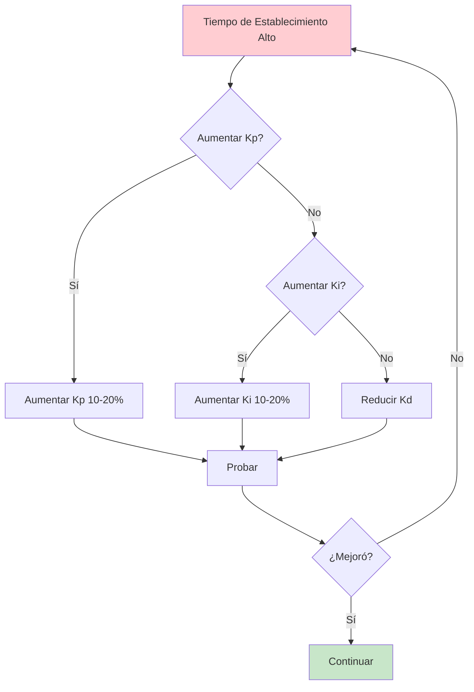

### 3. Ajuste de Error Estacionario

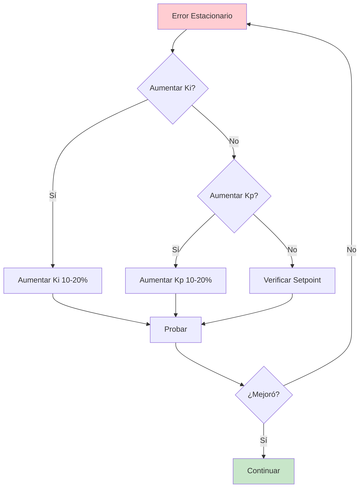

---

## Diagnóstico de Problemas

### 1. Oscilaciones Persistentes

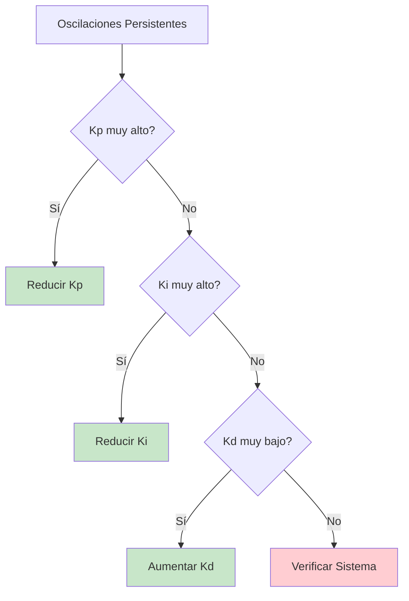

### 2. Respuesta Muy Lenta

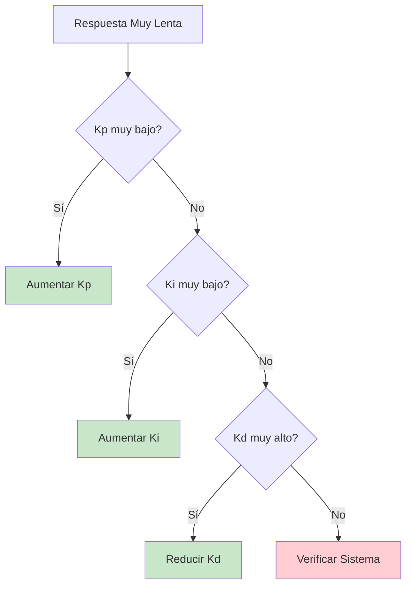

### 3. Inestabilidad

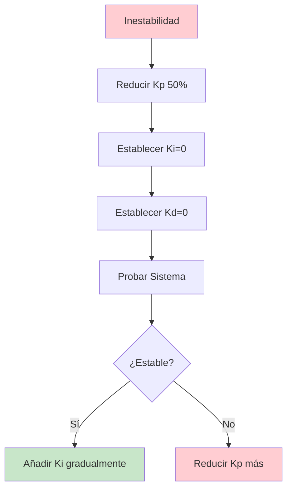

---

## Checklist de Tuning

### Antes del Tuning

- [ ] **Identificar el tipo de sistema**
- [ ] **Medir parámetros del sistema** (K, τ, L)
- [ ] **Establecer objetivos de rendimiento**
- [ ] **Preparar herramientas de medición**

### Durante el Tuning

- [ ] **Empezar con control P**
- [ ] **Añadir control I gradualmente**
- [ ] **Añadir control D si es necesario**
- [ ] **Documentar cada cambio**

### Después del Tuning

- [ ] **Verificar estabilidad**
- [ ] **Probar con diferentes setpoints**
- [ ] **Validar con disturbios**
- [ ] **Documentar configuración final**

---

## Casos de Estudio

### Caso 1: Horno Industrial

**Características**:
- τ = 180s (sistema lento)
- L = 5s (tiempo muerto)
- K = 0.015 (ganancia baja)

**Tuning Recomendado**:
- Kp = 2.0
- Ki = 0.1 s⁻¹
- Kd = 10 s

### Caso 2: Sistema de Enfriamiento

**Características**:
- τ = 60s (sistema medio)
- L = 2s (tiempo muerto bajo)
- K = -0.04 (ganancia negativa)

**Tuning Recomendado**:
- Kp = 1.5
- Ki = 0.15 s⁻¹
- Kd = 5 s

### Caso 3: Control de Velocidad

**Características**:
- τ = 0.1s (sistema rápido)
- L = 0s (sin tiempo muerto)
- K = 1.0 (ganancia unitaria)

**Tuning Recomendado**:
- Kp = 0.5
- Ki = 2.0 s⁻¹
- Kd = 0.05 s

---

## Resumen

### Métodos Principales

1. **Ziegler-Nichols**: Para sistemas FOPDT
2. **Cohen-Coon**: Variación mejorada de Z-N
3. **Respuesta al Escalón**: Método simple y directo

### Técnicas de Tuning

1. **Secuencial**: P → PI → PID
2. **Ensayo y Error**: Iterativo y práctico
3. **Heurístico**: Basado en reglas y experiencia

### Criterios de Optimización

- **Velocidad**: Tiempo de subida y establecimiento
- **Precisión**: Overshoot y error estacionario
- **Estabilidad**: Robustez y rechazo de disturbios

---

## Próximos Pasos

Ahora que dominas las técnicas de tuning, puedes:

1. **Practicar** con diferentes sistemas en el simulador
2. **Experimentar** con los métodos aprendidos
3. **Aplicar** técnicas avanzadas de optimización
4. **Explorar** control adaptativo y robusto

### Recursos Adicionales

- [Tutorial 3: Análisis de Respuesta](./03-response-analysis.md)
- [Tutorial 4: Casos Avanzados](./04-advanced-cases.md)
- [Ejemplos Prácticos](../examples/)
- [FAQ](../faq.md)

---

Has completado el tutorial de tuning PID. Ahora tienes las herramientas necesarias para ajustar controladores PID de manera sistemática y efectiva.

---

